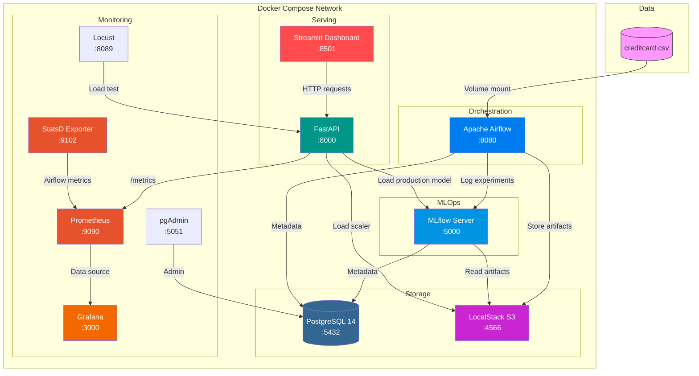
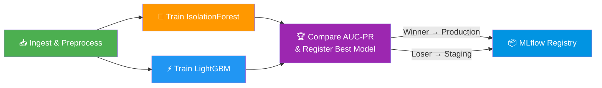
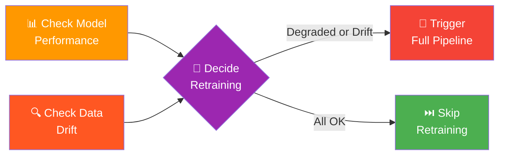

<p align="center">
  <h1 align="center">🛡️ FraudGuard</h1>
  <p align="center">
    <strong>Production-grade MLOps pipeline for credit card fraud detection</strong>
  </p>
  <p align="center">
    <em>Mastère Spécialisé IA — Télécom Paris, Institut Polytechnique de Paris — DATA713</em>
  </p>
</p>

<p align="center">
  <a href="https://github.com/tahianahajanirina/Fraudguard/actions/workflows/api-k8s-cicd.yml">
    
  </a>
  
  
  
  
  
  
  
</p>

---

## 📋 Overview

**FraudGuard** is a complete MLOps pipeline that trains, compares, and deploys machine learning models for credit card fraud detection. It trains two models — **IsolationForest** (unsupervised) and **LightGBM** (supervised) — compares them on **AUC-PR**, promotes the winner to production via **MLflow**, and serves real-time predictions through a **FastAPI** endpoint with a **Streamlit** dashboard.

The project demonstrates production-grade practices: experiment tracking, model registry, automated retraining with drift detection, containerized microservices, Kubernetes deployment, CI/CD pipelines, and load testing.

---

## 🏗️ Architecture



### ML Training Pipeline



### Continuous Retraining DAG



The `fraud_retraining_ct` DAG runs **daily**. It checks whether the production model's AUC-PR has dropped below **0.70** and whether the anomaly rate exceeds **5× the expected fraud rate** (data drift). If either condition is met, it triggers a full retraining via the `fraud_detection_pipeline` DAG.

---

## 📸 Screenshots

| Airflow DAGs | MLflow Experiments |
|---|---|
|  |  |

| FastAPI Docs | Streamlit Dashboard |
|---|---|
|  |  |

| Prometheus Targets | Grafana Dashboard |
|---|---|
|  |  |

| pgAdmin | Locust Load Testing |
|---|---|
|  |  |

---

## ✨ Features

- **Model Competition** — IsolationForest vs LightGBM compared on AUC-PR, the right metric for imbalanced data (0.17% fraud rate)
- **Experiment Tracking** — Full metric, parameter, and artifact logging via MLflow
- **Model Registry** — Automatic promotion of the best model to Production stage
- **Continuous Training** — Daily monitoring for performance degradation and data drift with automatic retraining
- **Real-Time Predictions** — FastAPI endpoint with risk scoring (HIGH / MEDIUM / LOW)
- **Batch Predictions** — Upload CSVs for bulk fraud analysis (up to 1000 transactions)
- **Interactive Dashboard** — Streamlit UI with KPIs, single/batch prediction, and model metrics
- **Load Testing** — Locust-based load testing with realistic transaction patterns
- **Kubernetes Ready** — Kustomize overlays for dev and prod environments
- **CI/CD Pipeline** — GitHub Actions builds, pushes to GHCR, and deploys to Kubernetes
- **S3 Artifact Storage** — LocalStack provides S3-compatible storage for all artifacts
- **Monitoring Stack** — Prometheus + Grafana + StatsD exporter for API and Airflow metrics

---

## 🛠️ Tech Stack

| Tool | Version | Role |
|------|---------|------|
| **Python** | 3.11 | Language across all services |
| **Apache Airflow** | 2.8 | DAG orchestration (LocalExecutor) |
| **MLflow** | 2.11 | Experiment tracking & Model Registry |
| **FastAPI** | 0.110 | REST prediction service |
| **Streamlit** | 1.32 | Dashboard UI |
| **LightGBM** | latest | Supervised fraud classifier |
| **scikit-learn** | latest | IsolationForest + preprocessing |
| **PostgreSQL** | 14 | Metadata store (Airflow + MLflow) |
| **LocalStack** | 3 | S3-compatible artifact storage |
| **Prometheus** | latest | Metrics collection & alerting |
| **Grafana** | latest | Metrics visualization & dashboards |
| **Docker Compose** | v2 | Local orchestration (13 services) |
| **Kubernetes** | 1.28+ | Production deployment |
| **Kustomize** | built-in | Environment overlays (dev/prod) |
| **GitHub Actions** | — | CI/CD pipeline |
| **Locust** | latest | Load testing |
| **uv** | latest | Fast Python package management |
| **Ruff** | latest | Linting & formatting |

---

## 🚀 Getting Started

### Prerequisites

#### For Docker Compose (local dev/demo)

| Requirement | Version | Notes |
|-------------|---------|-------|
| Docker Engine | 24+ | [Install](https://docs.docker.com/engine/install/) |
| Docker Compose | v2.20+ | Bundled with Docker Desktop |
| RAM | 8 GB+ | 6 GB minimum |
| Disk | 20 GB+ | For images + data |
| OS | Linux / macOS / Windows (WSL2) | |

#### For Kubernetes (production)

| Requirement | Version | Notes |
|-------------|---------|-------|
| k3s | v1.28+ | [Install](https://k3s.io/) — `curl -sfL https://get.k3s.io \| sudo sh -` |
| kubectl | v1.28+ | Bundled with k3s |
| RAM | 8 GB+ | |
| Disk | **50 GB+** | k3s duplicates images in its own containerd runtime |
| OS | Linux only | k3s does not support macOS/Windows natively |

> ⚠️ **Disk requirement for K8s:** The project images total ~6 GB. k3s stores a separate copy in its containerd runtime (`/var/lib/rancher/k3s/`), so you need at least 50 GB of free disk space for a comfortable deployment.

#### Dataset

- **`creditcard.csv`** placed at `~/creditcard.csv` (sibling of the project directory):

```
~/
├── creditcard.csv               # Kaggle Credit Card Fraud Detection dataset
└── Fraudguard/                  # ← this repository
```

> 📥 Download the dataset from [Kaggle](https://www.kaggle.com/datasets/mlg-ulb/creditcardfraud).

### Installation & Launch

```bash
# 1. Clone the repository
git clone https://github.com/tahianahajanirina/Fraudguard.git
cd Fraudguard

# 2. Create environment file
cp .env.example .env

# 3. Build and start all services (requires Docker Compose v2)
docker compose up --build -d

# 4. Wait ~60-90 seconds for bootstrap
#    (PostgreSQL, LocalStack S3 bucket, Airflow DB init)

# 5. Open Airflow UI and trigger the pipeline
#    http://localhost:8080 — login: admin/admin
#    Unpause and trigger the "fraud_detection_pipeline" DAG

# 6. Monitor the run (~5 minutes)
#    The pipeline trains both models and promotes the winner

# 7. Access the services
#    API:       http://localhost:8000/docs
#    Dashboard: http://localhost:8501
#    MLflow:    http://localhost:5000
#    pgAdmin:   http://localhost:5051
#    Prometheus: http://localhost:9090
#    Grafana:   http://localhost:3000 (admin/admin)
#    Locust:    http://localhost:8089
```

### Stopping

```bash
make down          # Stop containers (keep data)
make down-clean    # Stop containers + remove volumes
```

---

## 📁 Project Structure

```
Fraudguard/
├── airflow/                          # Airflow service
│   ├── dags/
│   │   ├── fraud_pipeline.py         # Main training pipeline (4 tasks)
│   │   └── fraud_retraining_ct.py    # Daily continuous training DAG
│   ├── Dockerfile
│   └── pyproject.toml
├── api/                              # FastAPI service
│   ├── main.py                       # Endpoints: predict, predict_batch, health, model_metrics
│   ├── Dockerfile
│   └── pyproject.toml
├── webapp/                           # Streamlit dashboard
│   ├── app.py                        # Entry point
│   ├── config.py                     # Global configuration
│   ├── pages/                        # Dashboard, Single Prediction, Batch, Metrics
│   ├── components/                   # Reusable UI components
│   ├── api/                          # HTTP client for backend
│   ├── styles/                       # CSS theming
│   └── Dockerfile
├── mlflow/                           # MLflow server
│   └── Dockerfile
├── prometheus/                       # Prometheus monitoring
│   ├── Dockerfile
│   └── prometheus.yml                # Scrape targets config
├── grafana/                          # Grafana dashboards
│   └── provisioning/
│       └── datasources/              # Auto-provisioned Prometheus datasource
├── tests/                            # Integration tests
│   ├── test_api.py                   # API endpoint tests
│   ├── test_preprocessing.py         # Data pipeline tests
│   ├── test_model.py                 # Model training tests
│   ├── test_pipeline.py              # End-to-end DAG tests
│   └── conftest.py                   # Shared fixtures
├── load_tests/
│   └── locustfile.py                 # Locust load testing
├── k8s/                              # Kubernetes manifests
│   ├── api/                          # Base API resources
│   ├── platform/                     # Platform services (postgres, mlflow, airflow, etc.)
│   └── overlays/
│       ├── dev/                      # Dev overlay (1 replica)
│       └── prod/                     # Prod overlay (2 replicas)
├── conception/                       # Architecture diagrams
├── .github/workflows/
│   └── api-k8s-cicd.yml             # CI/CD pipeline
├── docker-compose.yml                # Local orchestration (9 services)
├── Makefile                          # Development commands
├── deploy-k8s.sh                     # K8s deployment script
└── pyproject.toml                    # Root config (Ruff)
```

---

## 📡 API Reference

Base URL: `http://localhost:8000`

### `GET /`

Returns project metadata.

```bash
curl http://localhost:8000/
```

### `GET /health`

Health check — returns model status, MLflow connection, and scaler state.

```bash
curl http://localhost:8000/health
```

```json
{
  "status": "healthy",
  "model_name": "lightgbm_fraud",
  "model_stage": "Production",
  "mlflow_uri": "http://mlflow:5000",
  "scaler_loaded": true
}
```

### `POST /predict`

Single transaction prediction.

```bash
curl -X POST http://localhost:8000/predict \
  -H "Content-Type: application/json" \
  -d '{
    "V1": -1.3598, "V2": -0.0727, "V3": 2.5363, "V4": 1.3781,
    "V5": -0.3383, "V6": 0.4623, "V7": 0.2395, "V8": 0.0986,
    "V9": 0.3637, "V10": 0.0907, "V11": -0.5515, "V12": -0.6178,
    "V13": -0.9913, "V14": -0.3111, "V15": 1.4681, "V16": -0.4704,
    "V17": 0.2079, "V18": 0.0257, "V19": 0.4039, "V20": 0.2514,
    "V21": -0.0183, "V22": 0.2778, "V23": -0.1104, "V24": 0.0669,
    "V25": 0.1285, "V26": -0.1891, "V27": 0.1335, "V28": -0.0210,
    "Amount": 149.62
  }'
```

```json
{
  "is_fraud": false,
  "fraud_probability": 0.003,
  "risk_level": "LOW",
  "model_used": "lightgbm_fraud",
  "prediction_label": "NORMAL"
}
```

### `POST /predict_batch`

Batch predictions (max 1000 transactions).

```bash
curl -X POST http://localhost:8000/predict_batch \
  -H "Content-Type: application/json" \
  -d '{"transactions": [{"V1": -1.35, ..., "Amount": 149.62}]}'
```

### `GET /model_metrics`

Returns production model evaluation metrics (precision, recall, F1, ROC-AUC, AUC-PR).

```bash
curl http://localhost:8000/model_metrics
```

### `GET /metrics`

Prometheus metrics endpoint — exposes request counts, latency histograms, and prediction counters.

```bash
curl http://localhost:8000/metrics
```

---

## 🤖 ML Models

### Why Two Models?

| Model | Type | Approach | Strengths |
|-------|------|----------|-----------|
| **IsolationForest** | Unsupervised | Anomaly detection baseline | No labels needed, detects novel fraud patterns |
| **LightGBM** | Supervised | Gradient boosting classifier | High precision, learns from labeled examples |

### Hyperparameters

**IsolationForest**: `n_estimators=200`, `contamination` = actual fraud rate (~0.0017)

**LightGBM**: `num_leaves=63`, `learning_rate=0.05`, `scale_pos_weight` auto-calculated from class imbalance

### Why AUC-PR?

With only **0.17% fraud** in the dataset, accuracy and ROC-AUC are misleading — a model predicting "not fraud" for everything achieves 99.83% accuracy. **AUC-PR (Average Precision Score)** focuses on the minority class and is the correct metric for heavily imbalanced datasets. The model with the higher AUC-PR is promoted to Production; the other goes to Staging.

### Pipeline Details

1. **Ingest & Preprocess**: Load CSV → drop `Time` column → StandardScaler on `Amount` → 80/20 stratified split → save as Parquet
2. **Train**: Both models train in parallel, logging metrics/params/artifacts to MLflow
3. **Compare & Register**: AUC-PR comparison → winner promoted to Production in MLflow Model Registry

---

## 🔄 Continuous Training

The `fraud_retraining_ct` DAG runs **daily** and performs two checks:

1. **Performance Check** — Queries MLflow for the Production model's AUC-PR. If below **0.70**, retraining is triggered.
2. **Data Drift Check** — Runs IsolationForest on the test set. If the anomaly rate exceeds **5× the expected fraud rate**, drift is detected.

If either condition is met, the DAG triggers a full execution of `fraud_detection_pipeline`, which retrains both models, compares them, and promotes the new winner.

---

## ☸️ Kubernetes Deployment

> **Note:** The Kubernetes manifests are production-ready and validated. Local deployment with k3s requires a machine with at least 50 GB of available disk space (the Docker images total ~6 GB, and k3s needs additional space for its own container runtime). For demo purposes, Docker Compose is used to run all services locally.

### Orchestrator: k3s

The project targets [k3s](https://k3s.io/) — a lightweight, CNCF-certified Kubernetes distribution ideal for edge and resource-constrained environments. Installation:

```bash
curl -sfL https://get.k3s.io | INSTALL_K3S_EXEC="--docker --disable=traefik --write-kubeconfig-mode=644" sudo sh -
export KUBECONFIG=/etc/rancher/k3s/k3s.yaml
```

### Manifests Structure

```
k8s/
├── api/                    # Base: Deployment, Service, ConfigMap
├── platform/               # PostgreSQL, MLflow, Airflow, Webapp, LocalStack
└── overlays/
    ├── dev/                # 1 replica, lighter resources, fraudguard-dev namespace
    └── prod/               # 2 replicas, stricter limits, fraudguard-prod namespace
```

All services expose **NodePort** endpoints for external access:

| Service | NodePort | Internal Port |
|---------|----------|---------------|
| API | 30000 | 8000 |
| Airflow | 30001 | 8080 |
| MLflow | 30002 | 5000 |
| Webapp | 30003 | 8501 |

### Deploy

```bash
# Dev environment (k3s required, min 50 GB disk)
kubectl apply -k k8s/overlays/dev/

# Verify
kubectl -n fraudguard-dev get pods
kubectl -n fraudguard-dev get svc

# Production environment
kubectl apply -k k8s/overlays/prod/
```

### CI/CD Pipeline

The GitHub Actions workflow (`.github/workflows/api-k8s-cicd.yml`):

1. **Builds** Docker images for all services (API, Airflow, MLflow, Webapp)
2. **Pushes** to GitHub Container Registry (GHCR)
3. **Deploys** to Kubernetes via a self-hosted runner

| Branch | Environment | Namespace |
|--------|------------|-----------|
| `develop` | Dev | `fraudguard-dev` |
| `main` | Prod | `fraudguard-prod` |

---

## 🔥 Load Testing

[Locust](https://locust.io/) simulates realistic traffic patterns against the API:

- **Normal transactions** (75% of traffic) — legitimate transaction features
- **Fraud transactions** (25% of traffic) — suspicious high-risk patterns
- **Health checks** — periodic endpoint monitoring

```bash
# Start with Docker Compose (already included)
docker compose up locust

# Access Locust UI
open http://localhost:8089
```

---

## 🧪 Testing

```bash
make test                # Run all tests
make test-api            # API endpoint tests
make test-preprocessing  # Data pipeline tests
make test-model          # Model training tests
make test-pipeline       # End-to-end DAG tests

make lint                # Ruff linting
make format              # Ruff formatting
```

---

## 👥 Authors

| Name | GitHub |
|------|--------|
| **Tahiana Hajanirina Andriambahoaka** | [@tahianahajanirina](https://github.com/tahianahajanirina) |
| **Mohamed Amar** | — |
| **Ahmed Fakhfakh** | [@Ahmedfekhfakh](https://github.com/Ahmedfekhfakh) |
| **Oussama Bel Haj Rhouma** | — |
| **Mohamed Khalil Ounis** | — |

Mastère Spécialisé IA — Télécom Paris, Institut Polytechnique de Paris

Module DATA713 — MLOps

---

<p align="center">
  Built with ❤️ using Python, MLflow, Airflow, FastAPI, and Streamlit
</p>
