<div align="center">
  
  <h1>🛡️ FraudGuard — Détection de Fraude Bancaire avec MLOps</h1>
  <p><b>Pipeline MLOps complet pour la détection de fraude bancaire en temps réel.</b></p>
  <p>
    <a href="https://github.com/tahianahajanirina/Fraudguard/actions/workflows/api-k8s-cicd.yml"></a>
    
    
    
    
    
    
    
    
    
    
    
    
  </p>
</div>

<br>

> **Projet réalisé par [Tahiana Hajanirina Andriambahoaka](https://github.com/tahianahajanirina), Mohamed Amar, [Ahmed Fakhfakh](https://github.com/Ahmedfekhfakh), Oussama Bel Haj Rhouma et Mohamed Khalil Ounis**  
> dans le cadre du cours *DATA713 — MLOps* à Télécom Paris · Institut Polytechnique de Paris · Février 2026
---

## 📋 À propos du projet

**FraudGuard** est un pipeline MLOps de bout en bout conçu pour détecter les fraudes par carte bancaire en temps réel. Le système orchestre l'ensemble du cycle de vie ML — de l'ingestion des données au service de prédictions — avec un monitoring continu et un réentraînement automatique.

1. **Entraînement parallèle** de deux modèles (IsolationForest et LightGBM) avec comparaison automatique sur la métrique AUC-PR
2. **Registre de modèles** via MLflow avec promotion automatique du meilleur modèle en production
3. **API de prédiction temps réel** avec scoring de risque (HIGH / MEDIUM / LOW) et support batch (jusqu'à 1 000 transactions)
4. **Réentraînement continu** quotidien avec détection de dérive et surveillance des performances
5. **Dashboard interactif** Streamlit pour la visualisation des KPIs, prédictions unitaires et par lot
6. **Monitoring complet** Prometheus + Grafana + StatsD pour les métriques API et Airflow
7. **Déploiement Kubernetes** avec overlays Kustomize (dev/prod) et pipeline CI/CD GitHub Actions
8. **Tests de charge** Locust simulant des patterns de trafic réalistes

<p align="center">
  <a href="https://raw.githubusercontent.com/tahianahajanirina/Fraudguard/develop/docs/diagrams/architecture.svg">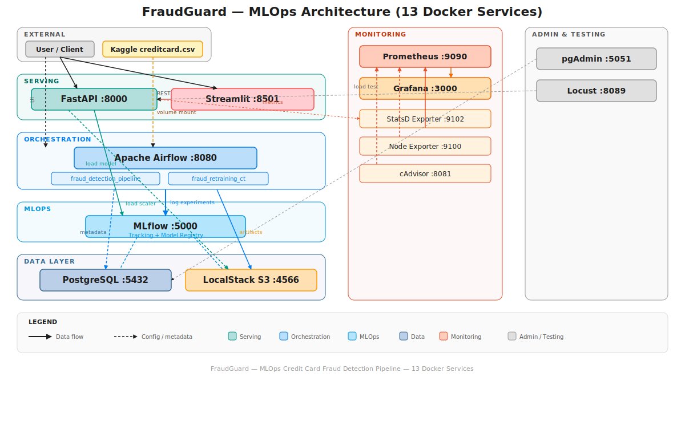</a>
</p>

---

## ✨ Fonctionnalités clés

| Fonctionnalité | Description |
|---|---|
| **Compétition de modèles** | IsolationForest vs LightGBM comparés sur AUC-PR, la métrique adaptée aux données déséquilibrées (0.17% de fraude) |
| **Tracking d'expériences** | Logging complet des métriques, paramètres et artefacts via MLflow |
| **Registre de modèles** | Promotion automatique du gagnant en Production, le perdant en Staging |
| **Réentraînement continu** | Surveillance quotidienne de la dégradation des performances et de la dérive des données |
| **Prédictions temps réel** | Endpoint FastAPI avec scoring de risque tri-niveau |
| **Prédictions par lot** | Upload CSV pour analyse groupée jusqu'à 1 000 transactions |
| **Dashboard interactif** | Interface Streamlit avec KPIs, prédictions et métriques du modèle |
| **Tests de charge** | Locust avec simulation de transactions normales (75%) et frauduleuses (25%) |
| **Kubernetes Ready** | Overlays Kustomize pour environnements dev et prod |
| **Pipeline CI/CD** | GitHub Actions : build, push GHCR, déploiement Kubernetes |
| **Stockage S3** | LocalStack fournit un stockage S3-compatible pour tous les artefacts |
| **Monitoring** | Prometheus + Grafana + StatsD + Node Exporter + cAdvisor |

---

## 🏗️ Architecture

Le système est composé de **13 services Docker** interconnectés, orchestrés via Docker Compose :

<div align="center">
  <a href="https://raw.githubusercontent.com/tahianahajanirina/Fraudguard/develop/docs/diagrams/architecture.svg"></a>
</div>

### Pipeline d'entraînement ML

<p align="center">
  <a href="https://raw.githubusercontent.com/tahianahajanirina/Fraudguard/develop/docs/diagrams/ml_pipeline.svg">
    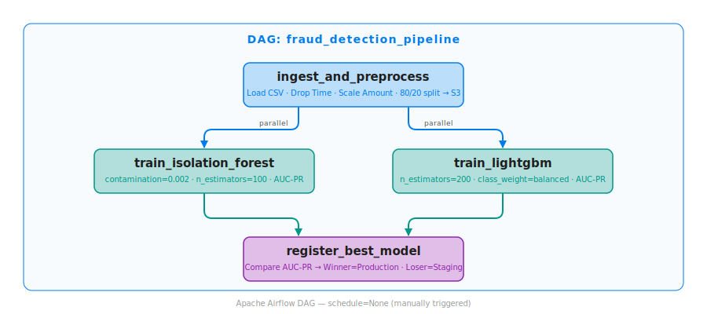
  </a>
</p>

### DAG de réentraînement continu

<p align="center">
  <a href="https://raw.githubusercontent.com/tahianahajanirina/Fraudguard/develop/docs/diagrams/retraining_dag.svg">
    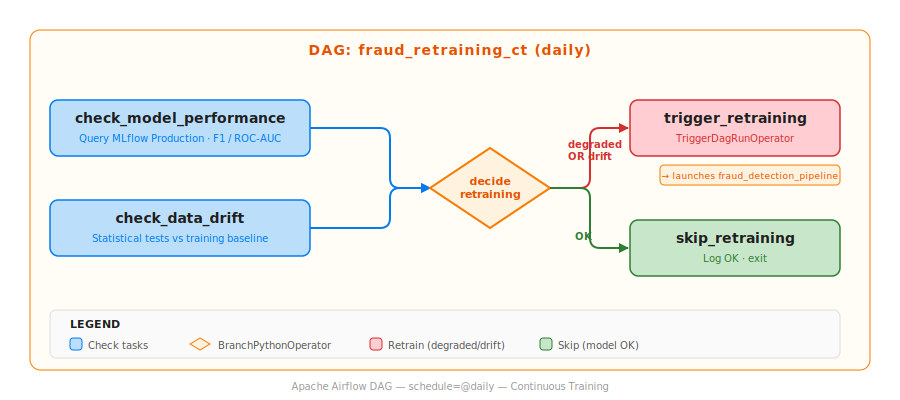
  </a>
</p>

Le DAG `fraud_retraining_ct` s'exécute **quotidiennement** et vérifie deux conditions :
- **Dégradation des performances** — Si l'AUC-PR du modèle en production chute sous **0.70**
- **Dérive des données** — Si le taux d'anomalies dépasse **5× le taux de fraude attendu**

Si l'une des conditions est remplie, un réentraînement complet est déclenché automatiquement.

---

## 📸 Captures d'écran

| Airflow DAGs | MLflow Expériences |
|---|---|
| 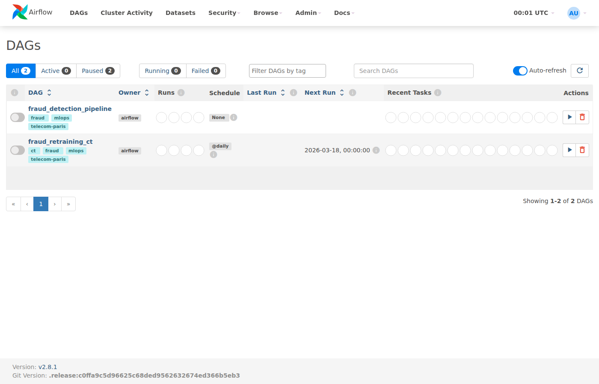 | 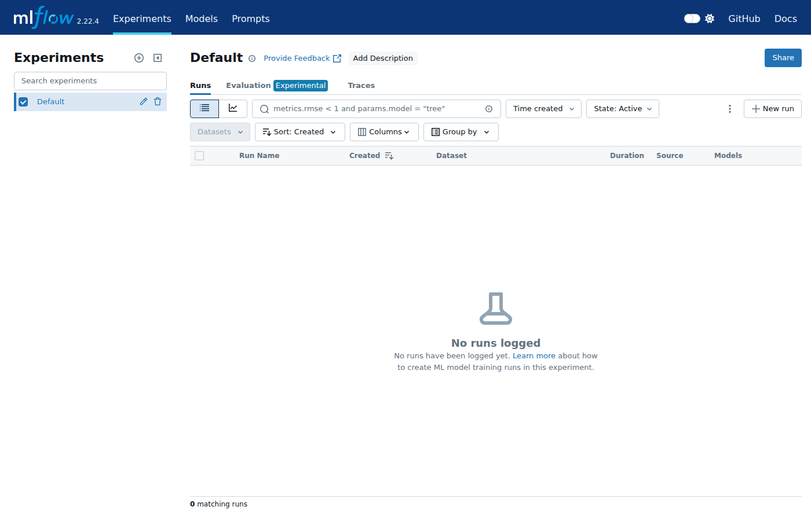 |

| FastAPI Documentation | Dashboard Streamlit |
|---|---|
| 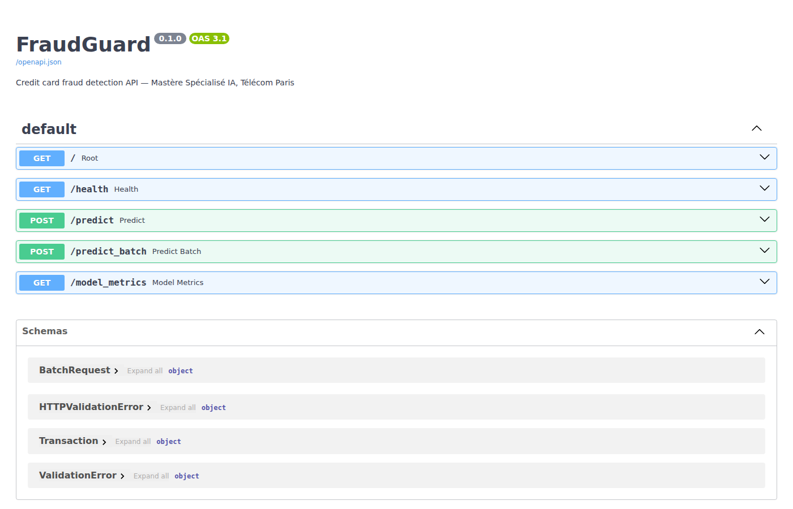 | 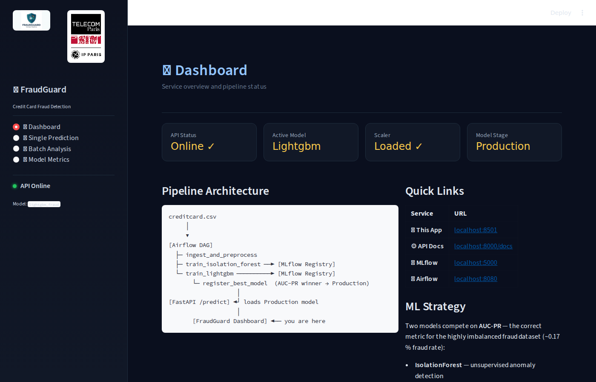 |

| Prometheus Targets | Grafana Dashboard |
|---|---|
| 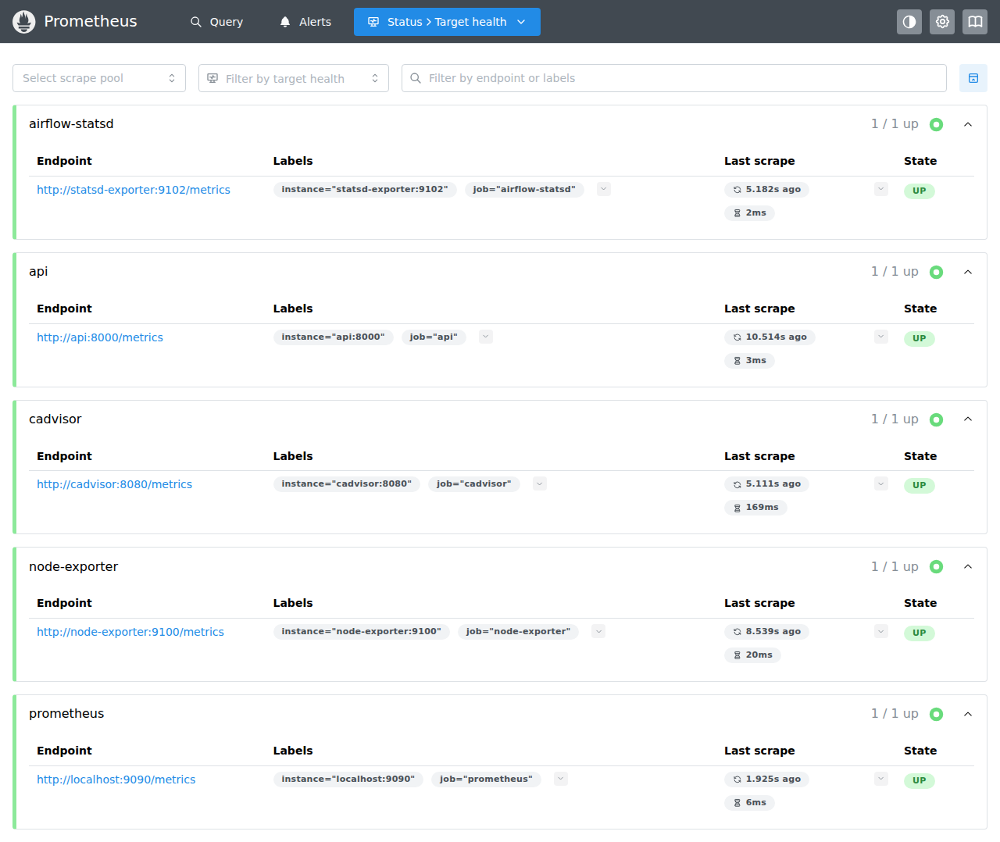 | 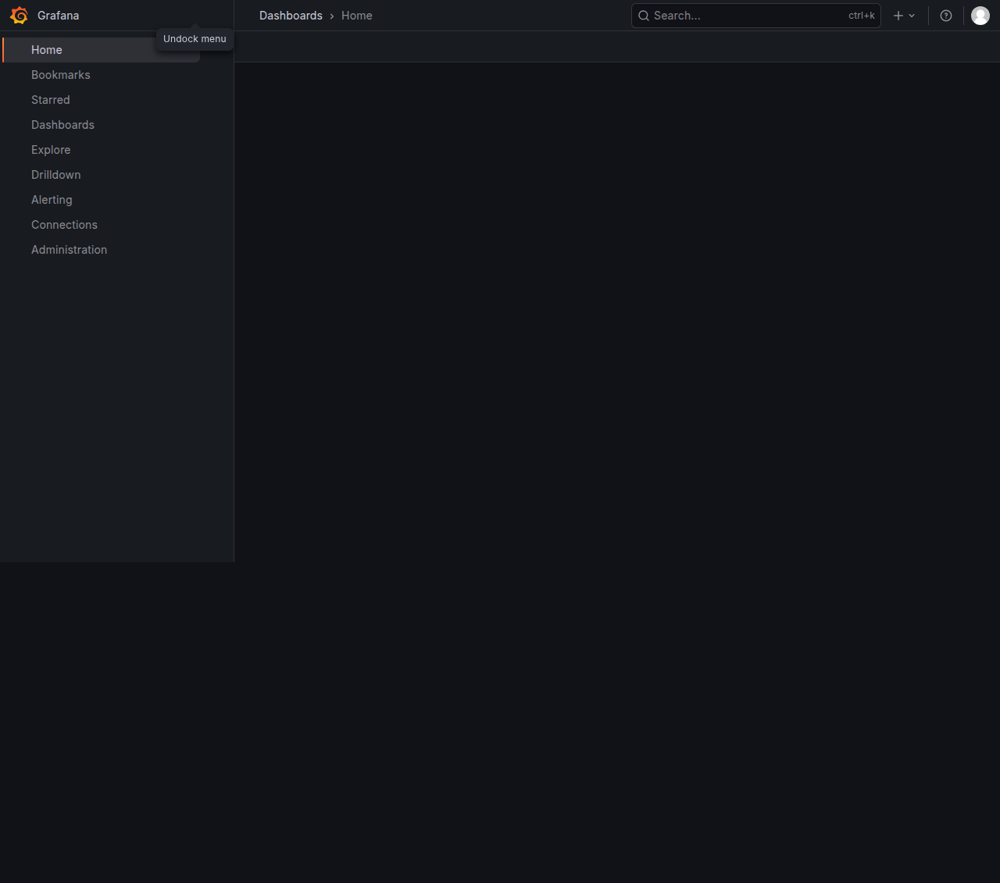 |

| pgAdmin | Locust Load Testing |
|---|---|
| 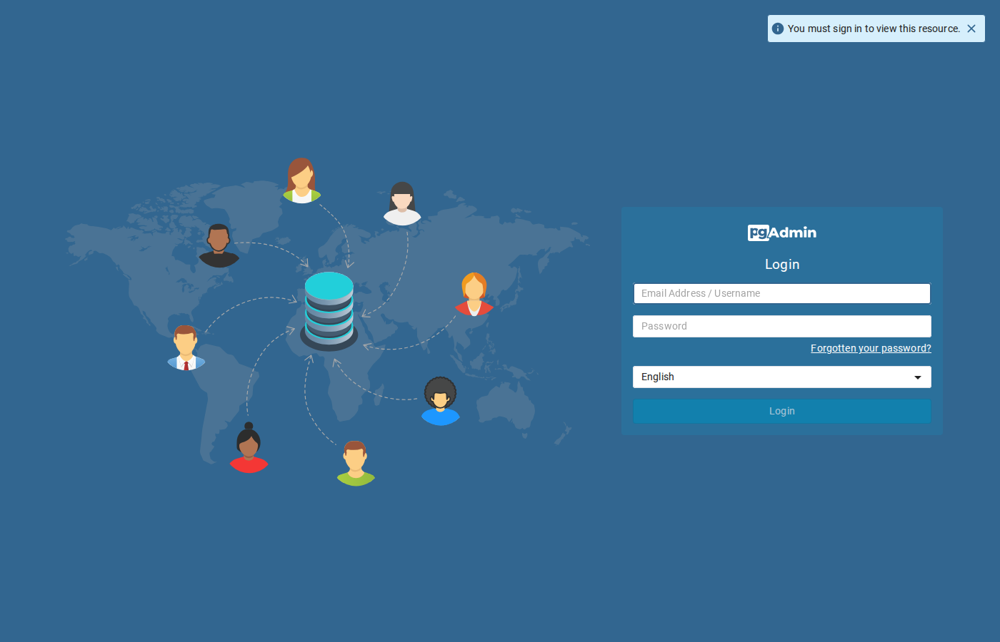 | 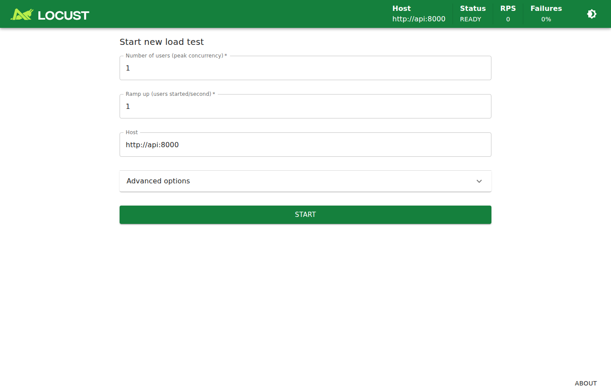 |

---

## 🛠️ Stack technique

| Composant | Technologie | Rôle |
|-----------|-------------|------|
| **Langage** | Python 3.11 | Langage principal de tous les services |
| **Orchestration ML** | Apache Airflow 2.8 | Exécution des DAGs avec LocalExecutor |
| **Tracking ML** | MLflow 2.11 | Suivi d'expériences et registre de modèles |
| **Modèle supervisé** | LightGBM 4.3 | Classificateur gradient boosting |
| **Modèle non-supervisé** | scikit-learn (IsolationForest) | Détection d'anomalies comme baseline |
| **Rééchantillonnage** | imbalanced-learn (SMOTE) | Gestion du déséquilibre de classes |
| **API de prédiction** | FastAPI 0.110 | Service REST haute performance |
| **Dashboard** | Streamlit 1.32 | Interface utilisateur interactive |
| **Base de données** | PostgreSQL 14 | Métadonnées Airflow et MLflow |
| **Stockage artefacts** | LocalStack 3 (S3) | Stockage S3-compatible pour les modèles |
| **Monitoring** | Prometheus + Grafana | Collecte et visualisation des métriques |
| **Métriques Airflow** | StatsD Exporter | Export des métriques Airflow vers Prometheus |
| **Métriques système** | Node Exporter + cAdvisor | Métriques host et conteneurs |
| **Tests de charge** | Locust | Simulation de trafic réaliste |
| **Conteneurisation** | Docker Compose v2 | Orchestration locale (13 services) |
| **Orchestration K8s** | Kubernetes (k3s) | Déploiement production |
| **Configuration K8s** | Kustomize | Overlays dev et prod |
| **CI/CD** | GitHub Actions | Build, push et déploiement automatisés |
| **Gestion de paquets** | uv | Installation rapide des dépendances Python |
| **Linting** | Ruff | Linting et formatage du code |

---

## 📊 Source de données

| Propriété | Valeur |
|-----------|--------|
| **Dataset** | [Credit Card Fraud Detection](https://www.kaggle.com/datasets/mlg-ulb/creditcardfraud) (Kaggle) |
| **Transactions** | 284 807 |
| **Fraudes** | 492 (0.173%) |
| **Features** | V1–V28 (PCA), Amount |
| **Feature supprimée** | Time (non pertinente) |
| **Prétraitement** | StandardScaler sur Amount, split stratifié 80/20, sauvegarde Parquet |

Le dataset `creditcard.csv` doit être placé dans le répertoire parent du projet :

```
~/
├── creditcard.csv               # Dataset Kaggle
└── Fraudguard/                  # ← ce dépôt
```

---

## 🤖 Machine Learning en détail

### Deux modèles en compétition

| Modèle | Type | Approche | Forces |
|--------|------|----------|--------|
| **IsolationForest** | Non-supervisé | Détection d'anomalies | Pas besoin de labels, détecte des patterns de fraude inédits |
| **LightGBM** | Supervisé | Gradient boosting | Haute précision, apprend des exemples labellisés |

### Hyperparamètres

**IsolationForest** :
- `n_estimators=200`
- `contamination` = taux de fraude réel (~0.0017)
- `max_samples=auto`

**LightGBM** :
- `boosting_type=gbdt`
- `num_leaves=63`
- `learning_rate=0.05`
- `n_estimators=1000`
- `scale_pos_weight` = calculé automatiquement selon le déséquilibre de classes

### Pourquoi l'AUC-PR ?

Avec seulement **0.17% de fraude**, l'accuracy et le ROC-AUC sont trompeurs — un modèle prédisant systématiquement "pas fraude" atteint 99.83% d'accuracy. L'**AUC-PR (Average Precision Score)** se concentre sur la classe minoritaire et constitue la métrique appropriée pour les datasets fortement déséquilibrés.

### Résultats du modèle en production (LightGBM)

| Métrique | Valeur |
|----------|--------|
| **AUC-PR** | 0.567 |
| **F1-Score** | 0.711 |
| **ROC-AUC** | 0.887 |

### Pipeline d'entraînement

```
1. Ingestion & Prétraitement
   └─▶ Chargement CSV → Suppression Time → StandardScaler sur Amount
       → Split stratifié 80/20 → Sauvegarde Parquet + Upload S3

2. Entraînement parallèle
   ├─▶ IsolationForest (logging MLflow : métriques, params, matrice de confusion)
   └─▶ LightGBM (logging MLflow : métriques, params, feature importance)

3. Comparaison & Enregistrement
   └─▶ Comparaison AUC-PR → Gagnant promu en Production → Perdant en Staging
```

### Réentraînement continu

Le DAG `fraud_retraining_ct` tourne **quotidiennement** et effectue deux vérifications :

1. **Check de performance** — Interroge MLflow pour l'AUC-PR du modèle en Production. Si < **0.70**, réentraînement déclenché.
2. **Check de dérive** — Exécute IsolationForest sur le jeu de test. Si le taux d'anomalies dépasse **5× le taux de fraude attendu**, dérive détectée.

---

## 🐳 Infrastructure Docker

### Services et ports

| Service | Port | Rôle |
|---------|------|------|
| **PostgreSQL** | 5432 | Base de métadonnées Airflow et MLflow |
| **MLflow** | 5000 | Tracking d'expériences et registre de modèles |
| **Airflow** | 8080 | Orchestration des DAGs (LocalExecutor) |
| **API (FastAPI)** | 8000 | Service de prédiction REST |
| **Webapp (Streamlit)** | 8501 | Dashboard interactif |
| **pgAdmin** | 5051 | Administration PostgreSQL |
| **LocalStack** | 4566 | Stockage S3-compatible pour artefacts |
| **Prometheus** | 9090 | Collecte et agrégation de métriques |
| **Grafana** | 3000 | Visualisation de métriques et dashboards |
| **StatsD Exporter** | 9102 / 9125 | Export des métriques StatsD vers Prometheus |
| **Node Exporter** | 9100 | Métriques système du host |
| **cAdvisor** | 8081 | Métriques des conteneurs Docker |
| **Locust** | 8089 | Interface de tests de charge |

---

## 📡 Référence API

Base URL : `http://localhost:8000`

### Endpoints

| Méthode | Route | Description |
|---------|-------|-------------|
| `GET` | `/` | Métadonnées du projet |
| `GET` | `/health` | État de santé (modèle, MLflow, scaler) |
| `POST` | `/predict` | Prédiction unitaire avec scoring de risque |
| `POST` | `/predict_batch` | Prédictions par lot (max 1 000 transactions) |
| `GET` | `/model_metrics` | Métriques du modèle en production |
| `GET` | `/metrics` | Endpoint Prometheus |

### Exemple de prédiction

```bash
curl -X POST http://localhost:8000/predict \
  -H "Content-Type: application/json" \
  -d '{
    "V1": -1.3598, "V2": -0.0727, "V3": 2.5363, "V4": 1.3781,
    "V5": -0.3383, "V6": 0.4623, "V7": 0.2395, "V8": 0.0986,
    "V9": 0.3637, "V10": 0.0907, "V11": -0.5515, "V12": -0.6178,
    "V13": -0.9913, "V14": -0.3111, "V15": 1.4681, "V16": -0.4704,
    "V17": 0.2079, "V18": 0.0257, "V19": 0.4039, "V20": 0.2514,
    "V21": -0.0183, "V22": 0.2778, "V23": -0.1104, "V24": 0.0669,
    "V25": 0.1285, "V26": -0.1891, "V27": 0.1335, "V28": -0.0210,
    "Amount": 149.62
  }'
```

```json
{
  "is_fraud": false,
  "fraud_probability": 0.003,
  "risk_level": "LOW",
  "model_used": "lightgbm_fraud",
  "prediction_label": "NORMAL"
}
```

### Niveaux de risque

| Niveau | Probabilité | Signification |
|--------|------------|---------------|
| **HIGH** | > 0.7 | Transaction très suspecte |
| **MEDIUM** | 0.3 – 0.7 | Transaction à surveiller |
| **LOW** | < 0.3 | Transaction normale |

---

## 🚀 Guide de démarrage

### Prérequis

| Requis | Version | Notes |
|--------|---------|-------|
| Docker Engine | 24+ | [Installer](https://docs.docker.com/engine/install/) |
| Docker Compose | v2.20+ | Inclus avec Docker Desktop |
| RAM | 8 Go+ | 6 Go minimum |
| Disque | 20 Go+ | Pour les images et données |
| OS | Linux / macOS / Windows (WSL2) | |

### Installation

```bash
# 1. Cloner le dépôt
git clone https://github.com/tahianahajanirina/Fraudguard.git
cd Fraudguard

# 2. Créer le fichier d'environnement
cp .env.example .env

# 3. Placer le dataset (si pas déjà fait)
# Télécharger creditcard.csv depuis Kaggle et le placer dans ~/creditcard.csv

# 4. Construire et lancer tous les services
make up
# ou : docker compose up --build -d

# 5. Attendre ~60-90 secondes pour le bootstrap
# (PostgreSQL, bucket S3 LocalStack, init Airflow)

# 6. Ouvrir l'UI Airflow et déclencher le pipeline
#    http://localhost:8080 — identifiants : admin/admin
#    Activer et déclencher le DAG "fraud_detection_pipeline"

# 7. Le pipeline s'exécute en ~5 minutes
#    Entraîne les deux modèles et promeut le gagnant
```

### Accès aux services

| Service | URL | Identifiants |
|---------|-----|-------------|
| **API (Swagger)** | http://localhost:8000/docs | — |
| **Dashboard** | http://localhost:8501 | — |
| **Airflow** | http://localhost:8080 | admin / admin |
| **MLflow** | http://localhost:5000 | — |
| **Grafana** | http://localhost:3000 | admin / admin |
| **Prometheus** | http://localhost:9090 | — |
| **pgAdmin** | http://localhost:5051 | — |
| **Locust** | http://localhost:8089 | — |

### Arrêt

```bash
make down          # Arrêter les conteneurs (conserver les données)
make down-clean    # Arrêter les conteneurs + supprimer les volumes
```

---

## 📁 Structure du projet

| Répertoire / Fichier | Contenu |
|---|---|
| `airflow/dags/fraud_pipeline.py` | Pipeline principal d'entraînement (4 tâches) |
| `airflow/dags/fraud_retraining_ct.py` | DAG de réentraînement continu quotidien |
| `airflow/Dockerfile` | Image Airflow avec dépendances ML |
| `api/main.py` | Endpoints FastAPI : predict, predict_batch, health, model_metrics, metrics |
| `api/Dockerfile` | Image API de prédiction |
| `webapp/app.py` | Point d'entrée Streamlit |
| `webapp/pages/` | Pages : Dashboard, Prédiction unitaire, Batch, Métriques |
| `webapp/components/` | Composants UI réutilisables (sidebar, charts, formulaires) |
| `webapp/api/client.py` | Client HTTP pour communiquer avec le backend |
| `mlflow/Dockerfile` | Image du serveur MLflow |
| `prometheus/prometheus.yml` | Configuration des scrape targets |
| `grafana/provisioning/` | Datasources et dashboards auto-provisionnés |
| `tests/` | Suite de tests (63 tests) |
| `load_tests/locustfile.py` | Tests de charge Locust |
| `k8s/api/` | Manifestes Kubernetes de base (Deployment, Service, ConfigMap) |
| `k8s/platform/` | Services plateforme (PostgreSQL, MLflow, Airflow, Webapp, LocalStack) |
| `k8s/overlays/dev/` | Overlay dev (1 réplica, namespace fraudguard-dev) |
| `k8s/overlays/prod/` | Overlay prod (2 réplicas, namespace fraudguard-prod) |
| `conception/` | Diagrammes d'architecture (drawio, png) |
| `.github/workflows/` | Pipelines CI/CD (tests + déploiement K8s) |
| `docker-compose.yml` | Orchestration locale (13 services) |
| `deploy-k8s.sh` | Script de déploiement Kubernetes |
| `Makefile` | Commandes de développement |

---

## 🧪 Tests

Le projet dispose de **63 tests** couvrant l'ensemble du pipeline :

| Fichier | Scope | Tests |
|---------|-------|-------|
| `tests/test_api.py` | Logique de prédiction unitaire, chemins LightGBM et IsolationForest | 9 |
| `tests/test_api_extended.py` | Endpoints API complets, gestion d'erreurs, cas limites | 23 |
| `tests/test_preprocessing.py` | Ingestion, split stratifié, scaling, persistance du scaler | 5 |
| `tests/test_model.py` | Réentraînement continu, branchements décisionnels, MLflow | 12 |
| `tests/test_pipeline.py` | Comparaison et promotion de modèles, best_model.txt | 3 |
| `tests/test_training.py` | Pipeline d'entraînement complet | 7 |
| `tests/test_retraining_extended.py` | DAG de réentraînement continu | 4 |
| `tests/conftest.py` | Fixtures partagées (app state, transactions, DataFrames) | — |

### Lancer les tests

```bash
make test                # Tous les tests
make test-api            # Tests API uniquement
make test-preprocessing  # Tests prétraitement
make test-model          # Tests modèle
make test-pipeline       # Tests pipeline end-to-end

make lint                # Linting Ruff
make format              # Formatage Ruff
```

---

## 📈 Monitoring

### Architecture de monitoring

Le stack de monitoring collecte des métriques à trois niveaux :

| Composant | Port | Métriques collectées |
|-----------|------|---------------------|
| **Prometheus** | 9090 | Agrégation centrale, scrape toutes les 15s |
| **Grafana** | 3000 | Dashboards de visualisation (datasource Prometheus auto-provisionné) |
| **StatsD Exporter** | 9102 | Métriques Airflow (durée des tâches, succès/échecs) |
| **Node Exporter** | 9100 | Métriques système (CPU, mémoire, disque, réseau) |
| **cAdvisor** | 8081 | Métriques conteneurs Docker (usage ressources par service) |

### Métriques API exposées

L'endpoint `/metrics` de l'API expose les métriques suivantes pour Prometheus :

| Métrique | Type | Description |
|----------|------|-------------|
| `api_requests_total` | Counter | Total des requêtes par endpoint/méthode/statut |
| `api_errors_total` | Counter | Total des erreurs par endpoint |
| `api_request_latency_seconds` | Histogram | Latence des requêtes |
| `model_predictions_total` | Counter | Prédictions par endpoint et résultat |
| `model_inference_latency_seconds` | Histogram | Latence d'inférence du modèle |

---

## 🔥 Tests de charge

[Locust](https://locust.io/) simule des patterns de trafic réalistes contre l'API :

| Scénario | Poids | Description |
|----------|-------|-------------|
| **Transaction normale** | 75% | Features caractéristiques d'une transaction légitime |
| **Transaction frauduleuse** | 25% | Pattern à haut risque (montant faible, features extrêmes) |
| **Health check** | Périodique | Surveillance de l'endpoint de santé |

```bash
# Déjà inclus dans docker-compose
docker compose up locust

# Accéder à l'interface Locust
# http://localhost:8089
```

---

## ☸️ Déploiement Kubernetes

### Orchestrateur : k3s

Le projet cible [k3s](https://k3s.io/) — une distribution Kubernetes légère et certifiée CNCF.

```bash
# Installation k3s
curl -sfL https://get.k3s.io | INSTALL_K3S_EXEC="--docker --disable=traefik --write-kubeconfig-mode=644" sudo sh -
export KUBECONFIG=/etc/rancher/k3s/k3s.yaml
```

> **Espace disque :** Les images Docker totalisent ~6 Go. k3s en stocke une copie séparée dans son runtime containerd, prévoyez au minimum **50 Go** d'espace disque libre.

### Services exposés via NodePort

| Service | NodePort | Port interne |
|---------|----------|-------------|
| API | 30000 | 8000 |
| Airflow | 30001 | 8080 |
| MLflow | 30002 | 5000 |
| Webapp | 30003 | 8501 |

### Déployer

```bash
# Environnement dev
make k8s-deploy-dev
# ou : kubectl apply -k k8s/overlays/dev/

# Vérifier
kubectl -n fraudguard-dev get pods
kubectl -n fraudguard-dev get svc

# Environnement production
make k8s-deploy-prod
# ou : kubectl apply -k k8s/overlays/prod/
```

### Pipeline CI/CD

Le workflow GitHub Actions (`.github/workflows/api-k8s-cicd.yml`) :

1. **Build** des images Docker (API, Airflow, MLflow, Webapp)
2. **Push** vers GitHub Container Registry (GHCR)
3. **Déploiement** sur Kubernetes via un runner self-hosted

| Branche | Environnement | Namespace |
|---------|--------------|-----------|
| `develop` | Dev | `fraudguard-dev` |
| `main` | Prod | `fraudguard-prod` |

---

## 👥 Auteurs

| | Nom | GitHub |
|---|---|---|
| 👨‍💻 | **Tahiana Hajanirina Andriambahoaka** | [@tahianahajanirina](https://github.com/tahianahajanirina) |
| 👨‍💻 | **Mohamed Amar** | — |
| 👨‍💻 | **Ahmed Fakhfakh** | [@Ahmedfekhfakh](https://github.com/Ahmedfekhfakh) |
| 👨‍💻 | **Oussama Bel Haj Rhouma** | — |
| 👨‍💻 | **Mohamed Khalil Ounis** | — |

---

<p align="center">
  <strong>Mastère Spécialisé Intelligence Artificielle</strong><br>
  Télécom Paris — Institut Polytechnique de Paris<br>
  Module DATA713 — MLOps<br><br>
  Construit avec Python, MLflow, Airflow, FastAPI, Streamlit, Docker et Kubernetes
</p>
