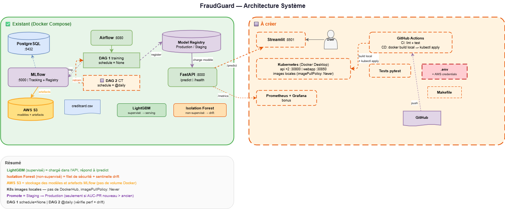

# FraudGuard — Document de Conception & Spécification Complète
# Projet MLOps — Détection de Fraude Bancaire
# Mastère Spécialisé IA — Télécom Paris

---

## 1. Contexte du projet

### 1.1 Le problème métier
La fraude bancaire coûte des milliards d'euros par an aux institutions financières. L'objectif est de détecter en temps réel les transactions frauduleuses parmi un volume massif de transactions légitimes, en appliquant les principes MLOps pour garantir un système fiable, traçable et maintenable en production.

### 1.2 Le dataset
- **Source** : https://www.kaggle.com/datasets/mlg-ulb/creditcardfraud
- **Volume** : 284 807 transactions sur 2 jours (septembre 2013)
- **Features** : V1-V28 (résultats d'une ACP = Analyse en Composantes Principales, anonymisés pour confidentialité), Time (secondes depuis la 1ère transaction), Amount (montant en euros)
- **Target** : Class (0 = transaction légitime, 1 = fraude)
- **Déséquilibre** : seulement 492 fraudes sur 284 807 transactions → **0.172% de fraudes**. Un modèle qui prédit "légitime" à chaque fois aurait 99.83% d'accuracy mais serait complètement inutile.

### 1.3 Sources de code
- **Notebook Kaggle** : "Anomaly Detection LightGBM Isolation Forest" (georgeyoussef1) — inspiration pour la logique ML
- **Repo GitHub** : https://github.com/Ahmedfekhfakh/Fraudguard — socle existant initié par Ahmed

### 1.4 Philosophie
Les profs ont été clairs : la performance du modèle n'est pas le sujet. Ce qui compte, c'est **tout ce qu'il y a autour** — orchestration, tracking, déploiement, monitoring, CI/CD, continuous training (= réentraînement automatique). Le code ML du notebook = ~5% de la valeur. Le système MLOps autour = ~95%.

---

## 2. Audit du repo existant

### 2.1 Arborescence actuelle
```
Fraudguard/
├── airflow/
│   ├── dags/
│   │   └── fraud_pipeline.py       ← Le pipeline principal (ingestion → entraînement → enregistrement)
│   ├── Dockerfile                   ← Image Docker pour Airflow + dépendances ML
│   ├── pyproject.toml
│   └── uv.lock
├── api/
│   ├── main.py                      ← L'API FastAPI (endpoints /predict, /health, etc.)
│   ├── Dockerfile                   ← Image Docker pour l'API
│   ├── pyproject.toml
│   └── uv.lock
├── docker-compose.yml               ← Lance les 4 services ensemble
├── init-db.sql                      ← Script SQL qui crée la base de données pour MLflow
├── pyproject.toml                   ← Configuration du linter ruff
├── .gitignore
├── .env.example                     ← Template pour les variables d'environnement (sans les vrais mots de passe)
└── README.md
```

### 2.2 Services Docker Compose existants

Docker Compose lance 4 services (= 4 conteneurs) qui communiquent entre eux :

**`postgres`** (postgres:14-alpine) — port 5432 (interne, pas exposé)
Base de données partagée : stocke les métadonnées d'Airflow (état des DAGs) et de MLflow (expériences, métriques).

**`mlflow`** (python:3.11-slim) — port 5000
Serveur MLflow : interface web pour voir les expériences + registre de modèles (= l'endroit où sont stockés les modèles entraînés avec leur version).

**`airflow`** (apache/airflow:2.8.1) — port 8080
Orchestrateur : exécute les pipelines (DAGs) automatiquement. Interface web pour les surveiller. Login : admin/admin.

**`api`** (python:3.11-slim) — port 8000
API FastAPI : reçoit une transaction en JSON, la passe au modèle, retourne "fraude" ou "légitime" avec une probabilité.

### 2.3 DAG existant : `fraud_detection_pipeline`

Un DAG (Directed Acyclic Graph) dans Airflow, c'est une suite de tâches qui s'exécutent dans un ordre précis. Celui-ci fait :

```
ingest_and_preprocess → [train_isolation_forest, train_lightgbm] → register_best_model
```

- **Fréquence : `schedule=None`** → ce DAG ne se lance pas automatiquement. Il doit être déclenché manuellement depuis l'interface Airflow ou par un autre DAG. C'est voulu : on ne veut pas réentraîner les modèles en boucle sans raison. C'est le DAG CT (voir section 3.4) qui décide quand il faut le relancer.

**Tâche 1 : `ingest_and_preprocess`** (préparation des données)
- Charge le fichier CSV des transactions
- Supprime la colonne Time (pas utile pour la prédiction)
- Normalise la colonne Amount (pour que les montants de 1€ et 10 000€ soient comparables)
- Sépare en jeu d'entraînement (80%) et jeu de test (20%), en gardant le même ratio de fraudes dans les deux (= split stratifié)
- Sauvegarde le tout en fichiers Parquet (format optimisé)

**Tâche 2a : `train_isolation_forest`** (entraînement modèle non-supervisé)
- Entraîne un Isolation Forest (voir section 3.1 pour les explications)
- Enregistre dans MLflow : les paramètres utilisés, les métriques de performance, la matrice de confusion (tableau qui montre les erreurs)

**Tâche 2b : `train_lightgbm`** (entraînement modèle supervisé)
- Entraîne un LightGBM (voir section 3.1 pour les explications)
- Enregistre dans MLflow : paramètres, métriques, matrice de confusion, importance des features (quelles colonnes influencent le plus la prédiction)

**Tâche 3 : `register_best_model`** (choisir le meilleur modèle)
- Compare les deux modèles sur la métrique **AUC-PR** (voir section 3.2 pour l'explication)
- Le meilleur est **promu** en "Production" dans MLflow (voir section 3.3 pour ce que "promouvoir" veut dire)
- Le moins bon reste en "Staging" (= en attente, prêt à prendre le relais si besoin)
- Écrit le nom du gagnant dans un fichier `best_model.txt` que l'API lit au démarrage

### 2.4 API existante : `api/main.py`

L'API est le point d'accès pour les utilisateurs et applications qui veulent savoir si une transaction est frauduleuse :

- `GET /` : informations générales sur le projet
- `GET /health` : "est-ce que l'API fonctionne et a bien chargé un modèle ?"
- `POST /predict` : envoie une transaction (29 chiffres : V1 à V28 + Amount) → reçoit une réponse du type `{"is_fraud": false, "fraud_probability": 0.003, "risk_level": "LOW"}`
- `POST /predict_batch` : même chose mais pour un lot de transactions (max 1000 à la fois)
- `GET /model_metrics` : retourne les métriques de performance du modèle actuellement en production (récupérées depuis MLflow)

### 2.5 Problèmes identifiés

1. **`.env` manquant** — Le fichier `docker-compose.yml` référence des variables comme `${POSTGRES_USER}` mais le fichier `.env` qui définit ces variables n'est pas dans le repo. **C'est bloquant : rien ne démarre sans ce fichier.**
2. **CSV monté depuis `../creditcard.csv`** — Le chemin suppose que le fichier CSV est dans un dossier au-dessus du projet. Fragile, ne marchera que sur la machine d'Ahmed.
3. **L'API dépend de `best_model.txt`** — Ce fichier est créé par Airflow. Si on lance l'API sans avoir d'abord exécuté le DAG Airflow, elle démarre sans modèle.
4. **Aucun test** — pytest est listé comme dépendance mais il n'y a aucun fichier de test.
5. **Pas de WebApp** — L'objectif 7 (interface graphique) est complètement absent.
6. **Pas de DAG de Continuous Training** — Il n'y a qu'un DAG (entraînement initial). Le réentraînement automatique (objectif 8) n'existe pas.
7. **Pas de Kubernetes / CI/CD** — Aucun fichier de déploiement K8s, aucun workflow GitHub Actions.
8. **Pas de monitoring** — L'API n'expose pas de métriques pour Prometheus, pas de dashboard Grafana.
9. **Artefacts en volume Docker local** — Les modèles et le scaler sont stockés dans un volume Docker partagé entre Airflow et l'API. Il faut migrer vers **AWS S3** pour que les modèles soient accessibles depuis n'importe quel environnement (dev, K8s) et persister entre les redémarrages.

---

## 3. Concepts clés expliqués

### 3.1 Les deux modèles — qui fait quoi ?

On entraîne deux modèles, mais ils n'ont **pas le même rôle** en production :

#### LightGBM — le modèle qui tourne en production

LightGBM est un modèle **supervisé** : pendant l'entraînement, il a vu des exemples de transactions **avec leur étiquette** ("cette transaction était une fraude", "celle-ci était légitime"). Il a appris à reconnaître les patterns.

En production, quand on lui envoie une nouvelle transaction, il retourne une **probabilité de fraude** (ex: 0.003 = 0.3% de chance que ce soit une fraude, ou 0.87 = 87% de chance). C'est ce modèle qui est chargé dans l'API FastAPI et qui répond aux requêtes `/predict`.

Il gagnera quasi toujours la comparaison car un modèle supervisé (qui a vu les réponses pendant l'entraînement) bat presque toujours un modèle non-supervisé (qui n'a pas vu les réponses).

#### Isolation Forest — un modèle non-supervisé avec deux utilités

L'Isolation Forest est un modèle **non-supervisé** : pendant l'entraînement, il n'a **pas** regardé la colonne "fraude/légitime". Il a simplement appris à quoi ressemblent des transactions "normales" en regardant la distribution des données. Quand il voit une transaction qui ne ressemble pas aux autres, il la considère comme une "anomalie".

Ce modèle a **deux utilités** dans notre projet :

**Utilité 1 : Filet de sécurité dans le pipeline de training (déjà en place)**

Le DAG `fraud_detection_pipeline` entraîne les deux modèles puis compare leurs performances. En temps normal, le LightGBM gagne haut la main. Mais si un jour il y a un problème (bug dans le code, données corrompues, mauvais hyperparamètres), l'Isolation Forest est là comme **plan B**. Si l'IF obtient un meilleur score que le LightGBM, c'est lui qui sera mis en production automatiquement. C'est un filet de sécurité.

**Utilité 2 : Sentinelle pour détecter le "data drift" dans le DAG CT (à créer)**

Le "data drift" (dérive des données), c'est quand les nouvelles données ne ressemblent plus à celles sur lesquelles le modèle a été entraîné. Par exemple : le profil des fraudeurs change, les montants moyens augmentent, de nouveaux patterns apparaissent. Quand ça arrive, le modèle en production fait des prédictions de plus en plus mauvaises **sans qu'on le sache** (car en production réelle, on n'a pas les vrais labels immédiatement).

L'Isolation Forest peut servir de **sentinelle** pour détecter ce problème :

1. On prend un lot de nouvelles transactions (ex: les 1000 dernières)
2. On les passe dans l'Isolation Forest (qui a appris ce qui est "normal" à l'entraînement)
3. L'IF nous dit quel pourcentage de ces transactions lui semblent "bizarres" (= anomalies)
4. En temps normal, ce pourcentage devrait être autour de 0.2% (le taux de fraude du dataset)
5. **Si ce pourcentage monte brusquement** (ex: 8% des transactions sont "bizarres") → ça veut dire que les nouvelles données ne ressemblent plus à celles de l'entraînement
6. C'est un signal d'alerte : il faut **réentraîner le modèle** sur des données plus récentes

Pourquoi c'est malin ? Parce qu'on détecte le problème **sans attendre les vrais labels** (qui arrivent parfois des semaines après en vraie vie).

```
Résumé visuel :

LightGBM ──────────► Chargé dans l'API ────► Répond aux requêtes /predict
                     (c'est le "titulaire")    "Cette transaction a 87% de chance d'être une fraude"

Isolation Forest ──► DAG de training ────────► Comparé au LightGBM sur l'AUC-PR
                     (rôle : filet de          En temps normal il perd. Mais s'il gagne,
                      sécurité)                il prend la place du LightGBM automatiquement.

                 ──► DAG de Continuous ──────► Analyse les nouvelles transactions en batch :
                     Training                  "Habituellement 0.2% d'anomalies, aujourd'hui 8%
                     (rôle : sentinelle)        → ALERTE ! Les données ont changé.
                                                → Déclenche un réentraînement du LightGBM."
```

### 3.2 AUC-PR — la métrique de comparaison

AUC-PR = **Area Under the Precision-Recall Curve** (Aire sous la courbe Précision-Rappel).

Pour comprendre, il faut d'abord comprendre les deux composantes :
- **Precision** (Précision) : parmi toutes les transactions que le modèle a étiquetées "fraude", combien étaient réellement des fraudes ? → "Quand il dit fraude, a-t-il raison ?"
- **Recall** (Rappel) : parmi toutes les vraies fraudes du dataset, combien le modèle en a-t-il trouvé ? → "Trouve-t-il toutes les fraudes ?"

La courbe Precision-Recall trace comment ces deux métriques évoluent quand on change le seuil de décision (à partir de quelle probabilité on dit "fraude"). L'AUC-PR est l'aire sous cette courbe : plus elle est proche de 1, mieux c'est.

**Pourquoi l'AUC-PR et pas la ROC-AUC classique ?**

Quand les classes sont très déséquilibrées (0.17% de fraudes), la ROC-AUC est trompeuse : un modèle médiocre peut afficher une ROC-AUC de 0.95 juste parce qu'il est bon pour dire "légitime" (ce qui est facile vu qu'il y a 99.83% de légitimes). L'AUC-PR est beaucoup plus sévère : elle ne récompense que les modèles qui trouvent réellement les fraudes.

```
ROC-AUC  → "Distingue-t-il les deux classes en général ?"
            Trompeur quand une classe domine (99.83% vs 0.17%)

AUC-PR   → "Trouve-t-il les fraudes sans trop de fausses alertes ?"
            Fiable même avec un déséquilibre extrême
            C'est CELLE QU'ON UTILISE dans le projet
```

Dans le code, c'est la fonction `average_precision_score` de scikit-learn.

### 3.3 Champion / Challenger et "Promote" — le système de mise en production

MLflow Model Registry (le registre de modèles) fonctionne comme un système de promotion :

**Champion** = le modèle actuellement en production, celui que l'API utilise pour répondre aux requêtes. Dans MLflow, son stage (étape) est **"Production"**.

**Challenger** = un modèle candidat qui vient d'être entraîné et qu'on compare au champion. Dans MLflow, son stage est **"Staging"** (= en attente de validation).

**Promote** (promouvoir) = faire passer un modèle de Staging à Production. Concrètement, c'est un appel à la fonction MLflow `transition_model_version_stage(stage="Production")`. Après cette opération, l'API chargera le nouveau modèle au prochain redémarrage.

**Le garde-fou** : on ne promeut un challenger que s'il a une meilleure AUC-PR que le champion actuel. Si le nouveau modèle est moins bon, il reste en Staging et le champion garde sa place. C'est ce qui empêche de dégrader la production par accident.

```
┌─────────────────┐                          ┌──────────────────┐
│    Staging       │     promote              │   Production     │
│  (candidat en    │ ──────────────────────►  │  (modèle actif   │
│   attente)       │  seulement si            │   dans l'API)    │
│                  │  AUC-PR nouveau          │                  │
│  Nouveau modèle  │  > AUC-PR ancien         │  Chargé par      │
│  fraîchement     │                          │  FastAPI au      │
│  entraîné        │  sinon : on ne fait      │  démarrage       │
│                  │  rien, l'ancien reste    │                  │
└─────────────────┘                          └──────────────────┘
```

### 3.4 Continuous Training (CT) — le réentraînement automatique

Le Continuous Training est le principe de réentraîner automatiquement le modèle quand c'est nécessaire, sans intervention humaine. C'est un concept central du MLOps (vu en cours : spécifique aux systèmes ML, n'existe pas en DevOps classique).

Dans notre projet, le CT est implémenté par le **DAG `fraud_retraining_ct`** (à créer). Ce DAG ne réentraîne pas lui-même : il **vérifie** si un réentraînement est nécessaire, et si oui, il **déclenche** le DAG de training existant (`fraud_detection_pipeline`). Le CT est le "déclencheur intelligent", le training pipeline est "l'exécutant".

### 3.5 Fréquences de déclenchement des DAGs

**`fraud_detection_pipeline`** → Fréquence : **`schedule=None`** (= jamais automatiquement)
Ce DAG est lourd (entraîne 2 modèles, ~5 min). On ne veut pas le lancer en boucle. Il est déclenché **manuellement** la première fois (pour créer le modèle initial) puis **par le DAG CT** quand un réentraînement est nécessaire.

**`fraud_retraining_ct`** → Fréquence : **`@daily`** (= une fois par jour)
Le DAG CT est léger (il vérifie juste les métriques et le drift, pas d'entraînement). Un check quotidien est un bon compromis : assez fréquent pour détecter les problèmes rapidement, pas trop pour éviter de surcharger le système. En production réelle, on pourrait le mettre à `@hourly` si le volume de transactions est élevé. Il peut aussi être déclenché **manuellement** depuis l'interface Airflow.

```
Cycle de vie des DAGs :

                      ┌────────────────────────────────────────┐
                      │      fraud_retraining_ct               │
                      │      Fréquence : @daily (tous les jours)│
Jour 1 ──────────────►│  check performance → OK                │
                      │  check drift → OK                      │
                      │  → Résultat : RAS, ne rien faire       │
                      └────────────────────────────────────────┘

                      ┌────────────────────────────────────────┐
                      │      fraud_retraining_ct               │
Jour 2 ──────────────►│  check performance → OK                │
                      │  check drift → ALERTE ! 8% d'anomalies│
                      │  → Résultat : DRIFT DÉTECTÉ            │
                      │  → Déclenche fraud_detection_pipeline  │───────►  Réentraînement
                      └────────────────────────────────────────┘          + comparaison
                                                                          + promote si meilleur
```

### 3.6 Prometheus et /metrics — le monitoring de l'API

Prometheus est un système de surveillance qui fonctionne comme un médecin de garde :
- Toutes les 15 secondes, il interroge l'API sur l'endpoint `GET /metrics`
- L'API répond avec des compteurs en texte brut (combien de requêtes, quelle latence, combien de fraudes détectées)
- Prometheus stocke ces chiffres avec un horodatage
- **Grafana** se branche sur Prometheus pour dessiner des graphiques en temps réel

L'endpoint `/metrics` n'existe pas encore dans le code d'Ahmed — c'est à ajouter.

---

## 4. Architecture cible



### 4.1 Services Docker Compose (environnement de développement)

```
┌──────────────────────────────────────────────────────────────────┐
│                    docker-compose.yml (DEV)                       │
├───────────┬────────┬──────────┬─────────┬───────────┬────────────┤
│ postgres  │ mlflow │ airflow  │   api   │  webapp   │ prometheus │
│ :5432     │ :5000  │ :8080    │ :8000   │  :8501    │ :9090      │
│ EXISTANT  │EXISTANT│ EXISTANT │EXISTANT │ À CRÉER   │ BONUS      │
└───────────┴────────┴──────────┴─────────┴───────────┴────────────┘
         │
         ▼
   ┌──────────────┐
   │   AWS S3      │  ← stockage externe (modèles + artefacts MLflow)
   │   (cloud)     │    credentials dans .env (AWS_ACCESS_KEY_ID, etc.)
   └──────────────┘
```

MLflow est configuré avec `--artifacts-destination s3://<bucket>/mlflow-artifacts/` pour stocker les modèles sur AWS S3 au lieu d'un volume Docker local. Cela permet aux modèles de persister indépendamment des conteneurs et d'être accessibles depuis n'importe quel environnement.

### 4.2 DAGs Airflow (avec fréquences)

```
DAG 1 : fraud_detection_pipeline (EXISTANT — à vérifier)
    Fréquence : schedule=None (déclenché manuellement ou par le DAG CT)
    Tâche 1 : ingestion + prétraitement des données
    Tâche 2a : entraîner Isolation Forest     } en parallèle
    Tâche 2b : entraîner LightGBM             }
    Tâche 3 : comparer les deux, promouvoir le meilleur en Production

DAG 2 : fraud_retraining_ct (À CRÉER)
    Fréquence : @daily (une fois par jour, léger)
    Tâche 1 : vérifier les métriques du modèle en Production (via MLflow)
    Tâche 2 : vérifier le drift des données (via Isolation Forest en batch)
    Tâche 3 : si dégradé ou drift détecté → relancer le DAG 1
              sinon → ne rien faire (log "tout va bien")
    Tâche 4 : notification du résultat
```

### 4.3 Cluster Kubernetes (environnement de production)

```
Cluster Kubernetes (Docker Desktop — images locales, pas de registry)
│
├── namespace: serving
│   ├── Deployment: fraud-api (2 replicas, imagePullPolicy: Never)
│   ├── Service NodePort: :30800 → :8000  (accessible via http://localhost:30800)
│   ├── Deployment: fraud-webapp (1 replica, imagePullPolicy: Never)
│   └── Service NodePort: :30850 → :8501  (accessible via http://localhost:30850)
│
└── (bonus) namespace: monitoring
    ├── Deployment: prometheus
    ├── Deployment: grafana
    └── Service NodePort: :30300 → :3000  (accessible via http://localhost:30300)
```

`imagePullPolicy: Never` = Kubernetes utilise les images Docker construites localement, pas de registry distant. Ça marche car Docker Desktop partage le même daemon entre le host et K8s.

### 4.4 Pipeline CI/CD (GitHub Actions)

CI = Continuous Integration (vérification automatique du code à chaque push)
CD = Continuous Deployment (déploiement automatique quand le code est validé)

```
Quand quelqu'un push du code ou ouvre une Pull Request :
  → CI : vérifier le style du code (ruff) + lancer les tests (pytest)

Quand du code est mergé dans la branche main :
  → CD : construire les images Docker localement (docker build)
       + déployer sur Kubernetes avec kubectl apply
       (images locales, pas de registry — imagePullPolicy: Never)
```

### 4.5 Arborescence cible complète

```
Fraudguard/
├── .github/
│   └── workflows/
│       ├── ci.yml                          ← À CRÉER
│       └── cd.yml                          ← À CRÉER
├── airflow/
│   ├── dags/
│   │   ├── fraud_pipeline.py               ← EXISTANT (à vérifier)
│   │   └── fraud_retraining_ct.py          ← À CRÉER
│   ├── Dockerfile                          ← EXISTANT (à vérifier)
│   ├── pyproject.toml                      ← EXISTANT
│   └── uv.lock                             ← EXISTANT
├── api/
│   ├── main.py                             ← EXISTANT (à enrichir : ajouter /metrics pour Prometheus)
│   ├── Dockerfile                          ← EXISTANT (à vérifier)
│   ├── pyproject.toml                      ← EXISTANT (ajouter la dépendance prometheus_client)
│   └── uv.lock                             ← EXISTANT
├── webapp/                                 ← À CRÉER (dossier complet)
│   ├── app.py
│   ├── Dockerfile
│   └── requirements.txt
├── k8s/                                    ← À CRÉER (dossier complet)
│   ├── namespaces.yaml
│   ├── api-deployment.yaml
│   ├── api-service.yaml
│   ├── webapp-deployment.yaml
│   └── webapp-service.yaml
├── monitoring/                             ← À CRÉER (bonus)
│   └── prometheus.yml
├── tests/                                  ← À CRÉER (dossier complet)
│   ├── test_preprocessing.py
│   ├── test_api.py
│   └── test_model.py
├── docker-compose.yml                      ← EXISTANT (ajouter les services webapp + prometheus)
├── .env                                    ← À CRÉER (ignoré par git, contient les mots de passe)
├── .env.example                            ← À CRÉER (template sans les vrais mots de passe)
├── init-db.sql                             ← EXISTANT
├── pyproject.toml                          ← EXISTANT
├── Makefile                                ← À CRÉER (raccourcis de commandes)
├── .gitignore                              ← EXISTANT (ajouter .env)
└── README.md                               ← EXISTANT (à enrichir)
```

---

## 5. Métriques à collecter

### Dans MLflow (enregistrées à chaque entraînement) — déjà en place
- `average_precision_score` : l'AUC-PR (voir section 3.2), métrique principale de comparaison entre modèles
- `f1_score` : moyenne harmonique de Precision et Recall (bon résumé en un seul chiffre)
- `precision_score` : "quand le modèle dit fraude, a-t-il raison ?"
- `recall_score` : "parmi les vraies fraudes, combien le modèle en a-t-il trouvé ?"
- `roc_auc_score` : aire sous la courbe ROC (loggée pour référence, mais on ne l'utilise pas pour comparer car trompeuse avec 0.17% de fraudes)

### Dans Prometheus/Grafana (collectées en temps réel par l'API) — à ajouter
- `fraudguard_requests_total` : compteur du nombre de requêtes reçues (par endpoint et code de retour)
- `fraudguard_request_duration_seconds` : histogramme des temps de réponse (pour voir si l'API ralentit)
- `fraudguard_predictions_total` : compteur des prédictions (séparé "fraude" vs "légitime", pour détecter si le modèle se met à tout classifier pareil)
- `fraudguard_prediction_proba` : distribution des probabilités de fraude retournées (si la moyenne dérive dans le temps, c'est un signal de drift)

---

## 6. Répartition des rôles — Les 5 personnes

*Règle d'or de l'équipe : Avant de commencer, nous définissons ensemble le format exact (JSON) de la donnée en entrée et en sortie. Chacun "mock" (simule) le travail des autres pour avancer en parallèle.*

### 👤 Rôle 1 : Data Scientist (Le Cerveau)
**Mission principale :** Créer l'algorithme de détection, tracer les expérimentations et valider les modèles.
* **[Objectif 2]** Construire un modèle de classification : développer un modèle de ML/DL adapté à la détection de fraude.
* **[Objectif 5]** Suivre les modèles et les expériences avec MLFlow : enregistrer les performances (métriques, paramètres) et suivre les versions.
* **[Objectif 3]** Stocker le modèle sur un model registry : sauvegarder le modèle entraîné pour qu'il soit prêt à être déployé.
* **[Objectif 15 - BONUS]** Ajouter de l'évaluation / human in the loop pour labelliser / corriger vos prédictions.

### 👤 Rôle 2 : Ingénieur Backend (Le Guichetier)
**Mission principale :** Développer et packager l'API qui servira le modèle en temps réel.
* **[Objectif 6]** Développer une API : construire une API permettant de recevoir une transaction et de recevoir une prédiction (ex: avec FastAPI). *(Mocking: renvoyer une fausse prédiction en attendant le modèle du Rôle 1).*
* **[Objectif 9 - Partie 1]** Dockeriser votre API : créer le Dockerfile pour encapsuler l'application.
* **[Objectif 16 - BONUS]** Gestion des accès à l'API de Serving et dashboard par utilisateur de l'API.

### 👤 Rôle 3 : Data Engineer (Le Logisticien)
**Mission principale :** Automatiser les flux de données et l'entraînement continu.
* **[Objectif 1]** Extraire et prétraiter les données : nettoyer les données Kaggle et les préparer pour l'entraînement.
* **[Objectif 4]** Créer un pipeline de réentraînement avec Apache Airflow : mettre en place les pipelines pour mettre à jour le modèle.
* **[Objectif 8]** Gérer l'Entraînement Continue (CT) : ajouter un ou plusieurs DAG Airflow avec des triggers pour réentraîner et déployer automatiquement un nouveau modèle avec des checks de performance.
* **[Objectif 11 - BONUS]** Gérer des données en live : concevoir le script qui simule l'arrivée continue de nouvelles transactions.

### 👤 Rôle 4 : DevOps / Cloud Engineer (L'Architecte)
**Mission principale :** Industrialiser l'infrastructure, le code et le déploiement.
* **[Objectif 10]** Versionner et documenter le projet sur GitHub : gérer la structure de fichiers propre et la documentation claire (README).
* **[Objectif 9 - Partie 2]** Déployer l'API sur un cluster Kubernetes en local (Docker Desktop ou MiniKube).
* **[Objectif 9 - Partie 3]** Utilisez la CI/CD de GitHub Actions pour automatiser le processus.
* **[Objectif 14 - BONUS]** Gérer correctement le versionning / montée de version et rollback des modèles en production.

### 👤 Rôle 5 : Full-Stack / QA & Ops (La Vigie)
**Mission principale :** Créer l'interface utilisateur, stress-tester le système et surveiller sa santé.
* **[Objectif 7]** Créer une WebApp pour interagir avec le modèle : développer une interface utilisateur simple (ex: Gradio, Streamlit) pour visualiser les résultats des prédictions.
* **[Objectif 12 - BONUS]** Ajouter du monitoring pour visualiser l'ensemble des métriques (API, perfs du modèle) via Prometheus + Grafana.
* **[Objectif 13 - BONUS]** Vous pouvez ajouter des tests de montée en charge (ex: avec Locust) pour prouver que le cluster K8s encaisse le choc.
* **[Objectif 17 - BONUS]** Alerting par mail lors d'un réentraînement ou d'une erreur.

---

### 🔍 Analyse critique de cette répartition

**✅ Ce qui est bien dans cette répartition :**

- Les 17 objectifs de l'énoncé sont tous couverts et assignés — rien n'est oublié.
- Les bonus sont répartis de façon équilibrée (1 bonus par personne).
- Les rôles sont clairs et les noms (Le Cerveau, Le Guichetier, etc.) aident à comprendre la mission.
- La règle du "mock" est excellente pour travailler en parallèle (ex: le Rôle 2 peut renvoyer une fausse prédiction en attendant le vrai modèle du Rôle 1).

**⚠️ Points d'attention — à adapter vu le travail déjà fait par Ahmed :**

Le repo d'Ahmed couvre déjà une bonne partie des objectifs 1, 2, 3, 4, 5, 6 et 9 (partie Dockerfile). Concrètement :

- **Obj 1** (extraction/prétraitement) — ✅ Fait (tâche `ingest_and_preprocess`).
  → **Rôle 3** : pas besoin de le recréer, mais doit le **vérifier** et créer le DAG CT (Obj 8) qui est le vrai travail restant.

- **Obj 2** (modèle ML) — ✅ Fait (LightGBM + IsolationForest).
  → **Rôle 1** : pas besoin de recréer les modèles, mais doit **vérifier** le code, valider les hyperparamètres, et surtout s'occuper du `.env` manquant + de l'enrichissement de l'API avec `/metrics` Prometheus.

- **Obj 3** (model registry) — ✅ Fait (MLflow Production/Staging).
  → **Rôle 1** : vérifier que la promotion (= passage en Production) fonctionne bien.

- **Obj 4** (pipeline Airflow) — ✅ Fait (1 DAG existe).
  → **Rôle 3** : le DAG de training existe. Le vrai travail est le DAG CT (Obj 8).

- **Obj 5** (MLflow tracking) — ✅ Fait (params, metrics, artefacts).
  → **Rôle 1** : vérifier, pas recréer.

- **Obj 6** (API FastAPI) — ✅ Fait (/predict, /predict_batch, /health).
  → **Rôle 2** : pas besoin de recréer l'API, mais doit l'**enrichir** (ajouter `/metrics` pour Prometheus) et vérifier les Dockerfiles.

- **Obj 9 partie 1** (Dockerfile) — ✅ Fait (api/Dockerfile, airflow/Dockerfile).
  → **Rôle 2** : vérifier, pas recréer.

**En résumé** : les Rôles 1, 2 et 3 ont moins de création "from scratch" que prévu initialement. Leur travail se recentre sur la **vérification** du code existant, la **correction** des problèmes identifiés (surtout le `.env` manquant), et les **enrichissements** (endpoint `/metrics`, DAG CT).

Les Rôles 4 et 5 ne sont pas impactés car Kubernetes, CI/CD, WebApp et Monitoring sont entièrement à créer.

**💡 Recommandation : redistribuer la charge avec ces ajustements**

- **Rôle 1** (Data Scientist) — Tâches originales : créer modèle + MLflow + Registry.
  → Tâches ajustées : **vérifier** modèle + MLflow + Registry. **Créer** le `.env` (urgent, bloque tout le monde, inclure AWS credentials). **Configurer** MLflow → AWS S3 (changer `--artifacts-destination`). **Enrichir** l'API avec `/metrics` Prometheus. **Enrichir** le README final.

- **Rôle 2** (Backend) — Tâches originales : créer API + Dockerfile.
  → Tâches ajustées : **vérifier** API + Dockerfile. **Écrire les tests pytest** (test_api.py, test_model.py, test_preprocessing.py) — c'est un objectif évalué et personne ne le couvre dans la répartition originale.

- **Rôle 3** (Data Engineer) — Tâches originales : créer ingestion + pipeline + CT.
  → Tâches ajustées : **vérifier** le DAG existant. **Créer** le DAG CT (Obj 8) — c'est le vrai gros morceau.

- **Rôle 4** (DevOps) — Tâches originales : K8s + CI/CD + doc.
  → Tâches ajustées : pas de changement, tout est à créer. Ajouter le **Makefile**.

- **Rôle 5** (Full-Stack/QA) — Tâches originales : WebApp + monitoring + tests charge.
  → Tâches ajustées : pas de changement, tout est à créer.

**⚠️ Lacune importante : les tests pytest ne sont assignés à personne dans la répartition originale.** L'énoncé les mentionne explicitement dans les livrables ("l'ensemble de vos tests : tests unitaires, test d'intégration, test end-to-end"). Le Rôle 2, qui a moins de travail de création que prévu, est le mieux placé pour s'en charger.

---

## 7. Matrice complète objectifs × personnes

**Rôle 1 — Data Scientist :**
🔍 Obj 2 (modèle), 🔍 Obj 3 (registry), 🔍 Obj 5 (MLflow), 🔧 Obj 6 (/metrics), 🔧 Obj 10 (README), 🎯 Fix .env, 🌟 Obj 15 (bonus)

**Rôle 2 — Backend :**
🔍 Obj 6 (vérifier API), 🔍 Obj 9p1 (Dockerfiles), 🔧 Obj 10 (tests pytest), 🌟 Obj 16 (bonus)

**Rôle 3 — Data Engineer :**
🔍 Obj 1 (vérifier ingestion), 🔍 Obj 4 (vérifier DAG), 🎯 Obj 8 (créer DAG CT), 🌟 Obj 11 (bonus), 🌟 Obj 17 (bonus)

**Rôle 4 — DevOps :**
🎯 Obj 9 (K8s + CI/CD), 🔧 Obj 10 (CI/CD + Makefile), 🌟 Obj 14 (bonus)

**Rôle 5 — Full-Stack / QA :**
🎯 Obj 7 (Streamlit), 🔧 Obj 10 (slides), 🌟 Obj 12 (bonus), 🌟 Obj 13 (bonus), 🌟 Obj 17 (bonus)

**Légende :** 🔍 vérifier l'existant — 🔧 enrichir/améliorer — 🎯 créer from scratch — 🌟 bonus

---

## 8. Timeline de la journée

**Durée totale : 6h30 (8h30 → 15h). Pas de pause déjeuner. Présentation à 15h.**

```
08h30-09h00  SETUP + COORDINATION (30 min)
             → Rôle 1 crée le fichier .env et le push immédiatement
             → Tous : git pull, docker-compose up --build
             → Vérifier que les 4 services existants tournent
             → Tour de table rapide : qui fait quoi, quels ports, quel format JSON
             → Chacun crée sa branche Git (feature/streamlit, feature/k8s, etc.)

09h00-12h00  DÉVELOPPEMENT PARALLÈLE (3h — le gros du travail)
             → Rôle 1 : .env + /metrics Prometheus + vérification ML + README
             → Rôle 2 : vérification API/Dockerfiles + tests pytest
             → Rôle 3 : DAG CT + vérification DAG existant
             → Rôle 4 : manifests K8s + workflows CI/CD + Makefile
             → Rôle 5 : WebApp Streamlit + Dockerfile + monitoring

12h00-13h30  INTÉGRATION + DÉPLOIEMENT (1h30)
             → Merge des branches dans main (Pull Requests)
             → Résolution des conflits (docker-compose.yml — Rôle 1 arbitre)
             → Test end-to-end : docker-compose up → DAG → API → Streamlit
             → Rôle 4 : docker build local → kubectl apply -f k8s/
             → Rôle 3 : trigger le DAG CT, montrer qu'il fonctionne
             → Corriger les bugs d'intégration

13h30-14h30  DOCUMENTATION + SCREENSHOTS (1h)
             → Rôle 5 : screenshots de toutes les interfaces (Airflow, MLflow, Swagger, Streamlit, K8s)
             → Rôle 5 : finalise les slides de présentation
             → Rôle 1 : met à jour le README final avec screenshots
             → Tout le monde relit et valide le repo

14h30-15h00  RÉPÉTITION (30 min)
             → Dry run de la présentation (6 min chrono, 2 essais)
             → Ajuster le rythme, répartir qui parle quand

15h00        PRÉSENTATION OFFICIELLE (6 min exposé + 4 min questions)
```

---

## 9. Instructions pour Claude Code

Ce document est la **spécification complète** du projet. Lors de l'implémentation :

1. **Ne pas toucher** aux fichiers existants qui fonctionnent, sauf pour les enrichir là où c'est indiqué (ajouter `/metrics` dans `api/main.py`, ajouter des services dans `docker-compose.yml`, configurer MLflow → AWS S3).

2. **Créer** les fichiers manquants dans cet ordre de priorité :
   - `.env` + `.env.example` (débloque tout le monde — inclure AWS credentials : `AWS_ACCESS_KEY_ID`, `AWS_SECRET_ACCESS_KEY`, `AWS_DEFAULT_REGION`, `S3_BUCKET_NAME`)
   - `webapp/` (app.py, Dockerfile, requirements.txt)
   - `airflow/dags/fraud_retraining_ct.py` (schedule `@daily`, avec check performance + check drift + branching + trigger)
   - `k8s/` (namespaces.yaml, api-deployment.yaml avec `imagePullPolicy: Never`, api-service.yaml, webapp-deployment.yaml, webapp-service.yaml)
   - `.github/workflows/` (ci.yml, cd.yml — CD fait `docker build` local + `kubectl apply`, **pas de push sur DockerHub**)
   - `tests/` (test_preprocessing.py, test_api.py, test_model.py)
   - `monitoring/prometheus.yml`
   - `Makefile`

3. **Mettre à jour** les fichiers existants :
   - `docker-compose.yml` → ajouter les services `webapp` et `prometheus`, configurer MLflow avec `--artifacts-destination s3://<bucket>/mlflow-artifacts/`, passer les variables AWS aux services qui en ont besoin
   - `api/main.py` → ajouter l'endpoint `GET /metrics` avec `prometheus_client`
   - `api/pyproject.toml` → ajouter `prometheus_client` dans les dépendances
   - `.gitignore` → ajouter `.env`
   - `README.md` → enrichir avec la nouvelle architecture et les instructions

4. **Spécificités infra** :
   - **AWS S3** pour les artefacts MLflow (modèles, scaler, etc.) — pas de volume Docker local
   - **Images Docker locales** pour K8s — pas de DockerHub, `imagePullPolicy: Never` dans les deployments
   - **Docker Desktop K8s** — partage le daemon Docker avec le host

5. **Conventions** : Python 3.11, linter ruff (line-length=100), pas de code superflu ("less is more" — les profs vérifient qu'on comprend ce qu'on fait), chaque fichier doit être fonctionnel.