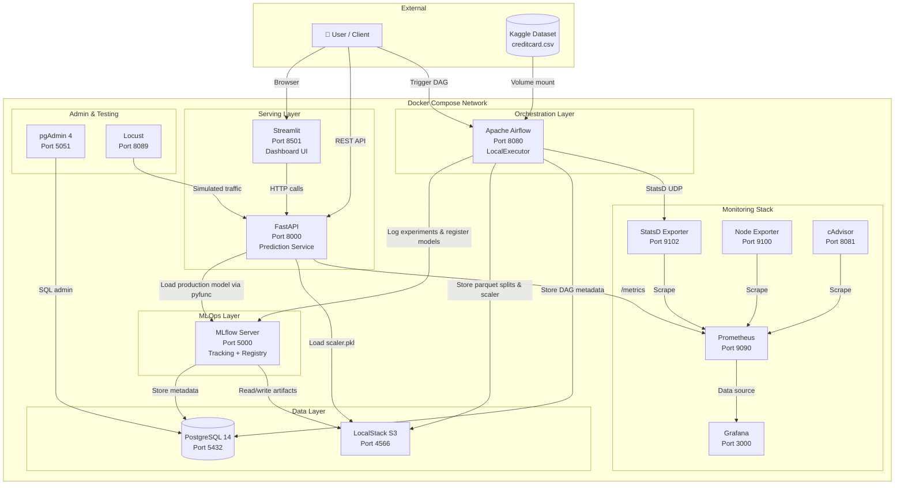
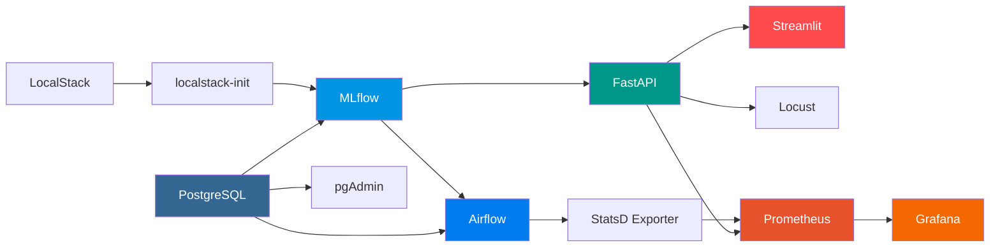
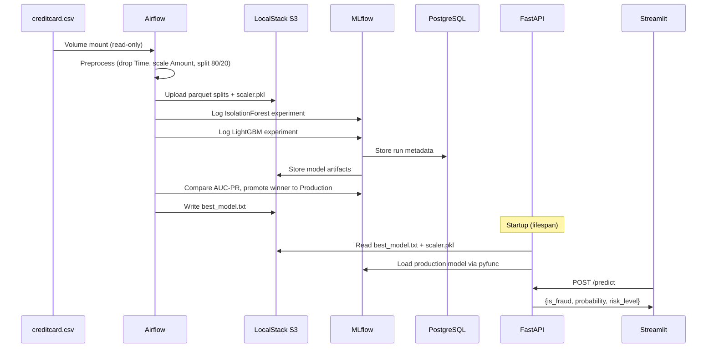

# 🏗️ Architecture

## Overview

FraudGuard follows a microservices architecture with 13 Docker containers orchestrated via Docker Compose. Each service has a single responsibility, communicating over a shared Docker network. The monitoring stack (Prometheus, Grafana, StatsD exporter, Node exporter, cAdvisor) provides observability across all services.

## System Architecture

## Service Details

### PostgreSQL (Data Layer)

- **Image**: `postgres:14-alpine`
- **Role**: Shared metadata store for both Airflow and MLflow
- **Databases**: Main DB for Airflow, `mlflow_db` for MLflow (created via `init-db.sql`)
- **Health check**: `pg_isready` + connectivity test to both databases
- **Persistence**: Named volume `postgres_data`

### LocalStack S3 (Data Layer)

- **Image**: `localstack/localstack:3`
- **Role**: S3-compatible object storage for MLflow artifacts
- **Bucket**: `s3://mlflow` (created by `localstack-init` one-shot container)
- **Stores**: Model artifacts, parquet data splits, scaler files, feature importance plots
- **Persistence**: Named volume `localstack_data`

### Apache Airflow (Orchestration Layer)

- **Executor**: LocalExecutor (single-node, sufficient for this pipeline)
- **DAGs**:
  - `fraud_detection_pipeline` — Main training pipeline (manual trigger)
  - `fraud_retraining_ct` — Daily continuous training with drift detection
- **Startup**: Runs `db init` → creates admin user → starts scheduler + webserver
- **Volumes**: Reads `creditcard.csv` (read-only), mounts `dags/` and `artifacts/`
- **Depends on**: PostgreSQL (healthy) + MLflow (healthy)

### MLflow (MLOps Layer)

- **Role**: Experiment tracking server + Model Registry
- **Backend store**: PostgreSQL (`mlflow_db`)
- **Artifact store**: LocalStack S3 (`s3://mlflow`)
- **Key features used**: `log_metric`, `log_param`, `log_figure`, `sklearn.log_model`, `pyfunc.log_model`, model stage transitions
- **Depends on**: PostgreSQL (healthy) + LocalStack S3 bucket (initialized)

### FastAPI (Serving Layer)

- **Endpoints**: `/predict`, `/predict_batch`, `/health`, `/model_metrics`, `/`
- **Model loading**: At startup via lifespan context manager
  1. Reads `/artifacts/best_model.txt` (model name, version, AUC-PR score)
  2. Loads model from MLflow: `models:/{name}/Production`
  3. Loads scaler from `/artifacts/scaler.pkl`
- **Prediction logic**:
  - LightGBM → `predict_proba()` for fraud probability
  - IsolationForest → binary prediction (1=normal, -1=anomaly)
  - Risk levels: HIGH (>0.7), MEDIUM (0.3–0.7), LOW (<0.3)
- **Depends on**: MLflow (healthy)

### Streamlit (Serving Layer)

- **Pages**: Dashboard, Single Prediction, Batch Analysis, Model Metrics
- **Communication**: HTTP client calls to FastAPI backend
- **Features**: KPI cards, Plotly charts, CSV upload/download, risk badges
- **Depends on**: FastAPI (healthy)

### Locust (Testing)

- **Role**: Load testing with realistic transaction patterns
- **Traffic mix**: 75% normal transactions, 25% fraud patterns
- **Wait time**: 0.5–2 seconds between requests

### Prometheus (Monitoring Stack)

- **Image**: `prom/prometheus:latest` (custom Dockerfile)
- **Role**: Metrics collection and storage
- **Scrape targets**: FastAPI `/metrics`, StatsD exporter, Node exporter, cAdvisor, self
- **Configuration**: `prometheus/prometheus.yml`
- **Persistence**: Named volume `prometheus_data`
- **Depends on**: API (healthy), Airflow (healthy), StatsD exporter, Node exporter, cAdvisor

### Grafana (Monitoring Stack)

- **Image**: `grafana/grafana:latest`
- **Role**: Metrics visualization and dashboarding
- **Data source**: Prometheus (auto-provisioned via `grafana/provisioning/datasources/datasource.yml`)
- **Persistence**: Named volume `grafana_data`
- **Depends on**: Prometheus

### StatsD Exporter (Monitoring Stack)

- **Image**: `prom/statsd-exporter:latest`
- **Role**: Receives StatsD metrics from Airflow (UDP port 9125) and exposes them as Prometheus metrics (port 9102)

### Node Exporter (Monitoring Stack)

- **Image**: `prom/node-exporter:latest`
- **Role**: Exports host-level system metrics (CPU, memory, disk, network)

### cAdvisor (Monitoring Stack)

- **Image**: `gcr.io/cadvisor/cadvisor:latest`
- **Role**: Container-level resource usage and performance metrics

### pgAdmin (Admin)

- **Role**: PostgreSQL administration UI
- **Depends on**: PostgreSQL (healthy)

## Service Dependency Chain

## Data Flow

## Network & Ports

All services share a single Docker network. External access is via port mapping:

| Service | Internal Port | External Port | URL |
|---------|--------------|---------------|-----|
| PostgreSQL | 5432 | 5432 | — |
| MLflow | 5000 | 5000 | http://localhost:5000 |
| Airflow | 8080 | 8080 | http://localhost:8080 |
| FastAPI | 8000 | 8000 | http://localhost:8000/docs |
| Streamlit | 8501 | 8501 | http://localhost:8501 |
| pgAdmin | 80 | 5051 | http://localhost:5051 |
| LocalStack | 4566 | 4566 | http://localhost:4566 |
| Locust | 8089 | 8089 | http://localhost:8089 |
| Prometheus | 9090 | 9090 | http://localhost:9090 |
| Grafana | 3000 | 3000 | http://localhost:3000 |
| StatsD Exporter | 9102 | 9102 | — |
| Node Exporter | 9100 | 9100 | — |
| cAdvisor | 8080 | 8081 | http://localhost:8081 |
