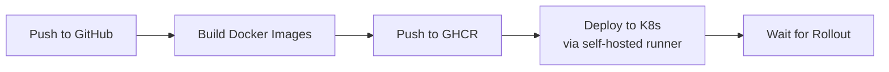

# 🚀 Deployment Guide

## Docker Compose (Local Development)

### Prerequisites

- Docker Engine 20.10+
- Docker Compose v2
- ~4 GB free RAM
- `creditcard.csv` in sibling directory (see project README)

### Setup

```bash
# 1. Clone and enter the project
git clone https://github.com/tahianahajanirina/Fraudguard.git
cd Fraudguard

# 2. Create environment file
cp .env.example .env

# 3. Build and start all services
docker compose up --build -d

# 4. Verify all services are healthy
docker compose ps
```

### Service Startup Order

Docker Compose handles the dependency chain automatically:

```
PostgreSQL → LocalStack → localstack-init (bucket creation)
                ↓                  ↓
              MLflow ←─────────────┘
                ↓
             Airflow
                ↓
             FastAPI
                ↓
           Streamlit + Locust
```

Wait ~60–90 seconds for full bootstrap on first run.

### Running the Pipeline

1. Open Airflow at http://localhost:8080 (default: admin/admin)
2. Unpause the `fraud_detection_pipeline` DAG
3. Trigger it manually (click the play button)
4. Wait ~5 minutes for training to complete
5. The API automatically loads the production model

### Useful Commands

```bash
# View logs for a specific service
docker compose logs -f api
docker compose logs -f airflow

# Restart a single service
docker compose restart api

# Stop everything (keep data)
docker compose down

# Stop and remove all data
docker compose down -v

# Rebuild a single service
docker compose up --build -d api
```

---

## Kubernetes Deployment

### Prerequisites

- **Docker Desktop** with Kubernetes enabled, or **Minikube**
- `kubectl` installed and configured
- Docker images built locally or pushed to a registry

### Architecture

```
k8s/
├── api/                    # Base API manifests
│   ├── deployment.yaml     # Pod template, probes, env vars
│   ├── service.yaml        # NodePort service
│   ├── configmap.yaml      # MLflow URI configuration
│   └── kustomization.yaml
├── platform/               # Platform service manifests
│   ├── postgres-statefulset.yaml
│   ├── mlflow-deployment.yaml
│   ├── airflow-web-deployment.yaml
│   ├── airflow-scheduler-deployment.yaml
│   ├── webapp-deployment.yaml
│   ├── localstack-deployment.yaml
│   ├── localstack-init-job.yaml
│   ├── shared-artifacts-pvc.yaml
│   └── kustomization.yaml
└── overlays/
    ├── dev/                # Development environment
    │   ├── kustomization.yaml
    │   ├── deployment-patch.yaml   # 1 replica, lighter resources
    │   ├── namespace.yaml          # fraudguard-dev
    │   └── secrets.yaml
    └── prod/               # Production environment
        ├── kustomization.yaml
        ├── deployment-patch.yaml   # 2 replicas, stricter limits
        ├── namespace.yaml          # fraudguard-prod
        └── secrets.yaml
```

### Deploy with Make

```bash
# Build Docker images
make k8s-build

# Deploy to dev
make k8s-deploy-dev

# Deploy to prod
make k8s-deploy-prod

# Destroy environments
make k8s-destroy-dev
make k8s-destroy-prod
```

### Deploy Manually

```bash
# Dev
kubectl apply -k k8s/overlays/dev

# Prod
kubectl apply -k k8s/overlays/prod

# Verify
kubectl -n fraudguard-dev get pods
kubectl -n fraudguard-dev get svc
```

### Access Services

```bash
# Port-forward the API
kubectl -n fraudguard-dev port-forward svc/fraudguard-api 8000:8000

# Check health
curl http://localhost:8000/health

# View logs
kubectl -n fraudguard-dev logs deploy/fraudguard-api --tail=100

# Check rollout status
kubectl -n fraudguard-dev rollout status deployment/fraudguard-api
```

### Environment Differences

| Setting | Dev | Prod |
|---------|-----|------|
| Namespace | `fraudguard-dev` | `fraudguard-prod` |
| API replicas | 1 | 2 |
| Image pull policy | IfNotPresent | Always |
| Resource limits | Lighter | Stricter |

---

## CI/CD Pipeline

### Workflow: `.github/workflows/api-k8s-cicd.yml`

**Triggers**:
- Push to `develop` → deploy dev
- Push to `main` → deploy prod
- `workflow_dispatch` → manual environment selection

### Pipeline Steps



**Images built**:
- `ghcr.io/<owner>/fraudguard-api`
- `ghcr.io/<owner>/fraudguard-airflow`
- `ghcr.io/<owner>/fraudguard-mlflow`
- `ghcr.io/<owner>/fraudguard-webapp`

### Required Setup

1. **Self-hosted runner**: Install a GitHub Actions runner on the machine with Kubernetes access
2. **Repository secrets** (Settings → Secrets):

| Secret | Required | Description |
|--------|----------|-------------|
| `KUBE_CONTEXT` | Optional | e.g., `docker-desktop` |
| `MLFLOW_TRACKING_URI` | Optional | e.g., `http://host.docker.internal:5000` |
| `GHCR_USERNAME` | Optional | For private images |
| `GHCR_PAT` | Optional | GitHub PAT for GHCR |
| `POSTGRES_USER` | Yes | PostgreSQL username |
| `POSTGRES_PASSWORD` | Yes | PostgreSQL password |
| `POSTGRES_DB` | Yes | PostgreSQL database name |

### Deployment Verification

After a CI/CD deployment:

```bash
# Check pod status
kubectl -n fraudguard-dev get pods

# Check rollout
kubectl -n fraudguard-dev rollout status deployment/fraudguard-api

# View recent logs
kubectl -n fraudguard-dev logs deploy/fraudguard-api --tail=50

# Test the API
kubectl -n fraudguard-dev port-forward svc/fraudguard-api 8000:8000 &
curl http://localhost:8000/health
```
