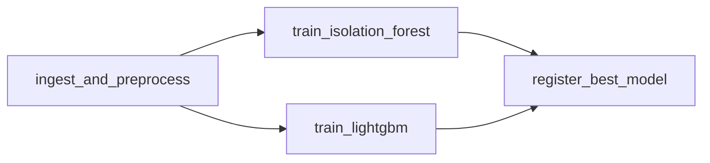
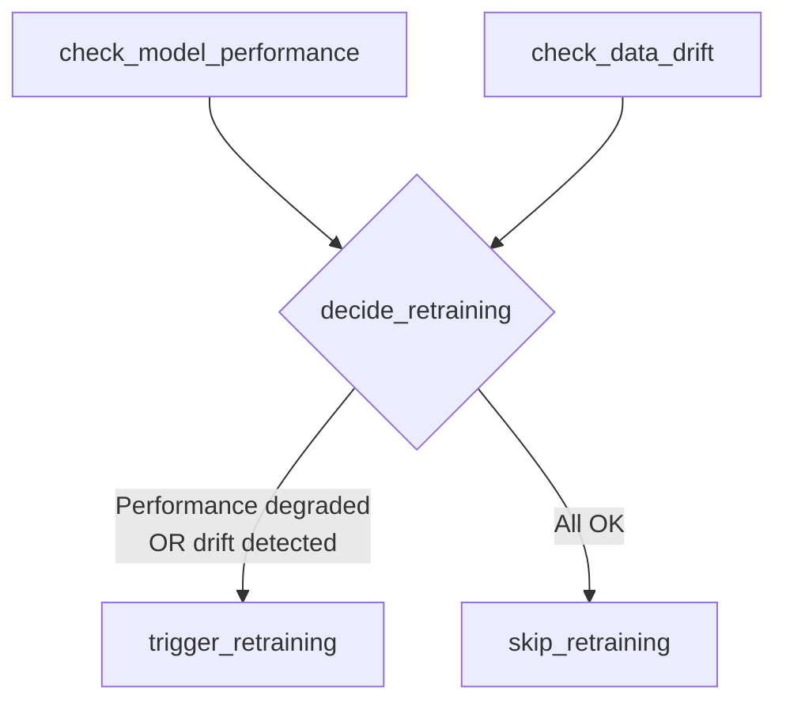

# 🤖 ML Pipeline

## Overview

The FraudGuard ML pipeline is orchestrated by Apache Airflow and consists of two DAGs:

1. **`fraud_detection_pipeline`** — Main training pipeline (manual trigger)
2. **`fraud_retraining_ct`** — Daily continuous training with drift detection

## Training Pipeline

### DAG: `fraud_detection_pipeline`



### Task 1: Ingest & Preprocess

**Input**: `creditcard.csv` (284,807 transactions, 31 columns)

**Steps**:
1. Load CSV from `/opt/airflow/data/creditcard.csv` (falls back to S3 download)
2. Drop the `Time` column (not useful for fraud detection)
3. Fit `StandardScaler` on the `Amount` column of the training set
4. Apply scaler to both train and test sets
5. Stratified 80/20 train/test split (preserves the ~0.17% fraud ratio)
6. Save outputs as Parquet files + scaler as joblib

**Outputs**:
- `X_train.parquet`, `X_test.parquet`, `y_train.parquet`, `y_test.parquet`
- `scaler.pkl` (StandardScaler fitted on training data)
- Dataset uploaded to S3 with SHA256 hash for change detection

### Task 2: Train IsolationForest

**Model**: Unsupervised anomaly detection

| Hyperparameter | Value | Rationale |
|----------------|-------|-----------|
| `n_estimators` | 200 | Sufficient trees for stable anomaly scores |
| `contamination` | ~0.0017 | Set to actual fraud rate in training data |
| `random_state` | 42 | Reproducibility |
| `n_jobs` | -1 | Use all CPU cores |

**Logged to MLflow**:
- Metrics: precision, recall, F1-score, ROC-AUC, AUC-PR (average_precision_score)
- Parameters: all hyperparameters
- Artifacts: confusion matrix plot
- Model: registered as `isolation_forest_fraud`

**Prediction logic**: Returns `1` (normal) or `-1` (anomaly). Converted to binary: `-1 → 1 (fraud)`, `1 → 0 (normal)`.

### Task 3: Train LightGBM

**Model**: Supervised gradient boosting classifier

| Hyperparameter | Value | Rationale |
|----------------|-------|-----------|
| `objective` | `binary` | Binary classification |
| `num_leaves` | 63 | Moderate complexity |
| `learning_rate` | 0.05 | Conservative learning |
| `n_estimators` | 300 | Sufficient iterations |
| `scale_pos_weight` | auto | Calculated from class ratio to handle imbalance |
| `random_state` | 42 | Reproducibility |

**Logged to MLflow**:
- Metrics: precision, recall, F1-score, ROC-AUC, AUC-PR
- Parameters: all hyperparameters
- Artifacts: confusion matrix, feature importance plot (top 15 features)
- Model: registered as `lightgbm_fraud`

### Task 4: Register Best Model

**Comparison metric**: AUC-PR (Average Precision Score)

**Process**:
1. Retrieve AUC-PR for both models from MLflow
2. The model with the higher AUC-PR is promoted to **Production** stage
3. The other model is moved to **Staging** stage
4. Writes `/artifacts/best_model.txt`:
   ```
   lightgbm_fraud        # model name
   1                     # version number
   0.8234                # AUC-PR score
   ```

## Why AUC-PR?

The dataset has extreme class imbalance: only **0.17%** of transactions are fraudulent.

| Metric | Problem with Imbalanced Data |
|--------|------------------------------|
| **Accuracy** | A "predict all normal" model gets 99.83% — useless |
| **ROC-AUC** | Inflated by the large number of true negatives |
| **AUC-PR** | Focuses on precision-recall tradeoff for the minority class |

AUC-PR (Average Precision Score) measures how well the model identifies fraud specifically, making it the correct choice for this problem.

## Continuous Retraining DAG

### DAG: `fraud_retraining_ct`

**Schedule**: `@daily`



### Task: Check Model Performance

- Queries MLflow registry for the Production model
- Reads the model's AUC-PR from its training run
- **Threshold**: AUC-PR < **0.70** → performance degraded

### Task: Check Data Drift

- Loads the latest IsolationForest from MLflow registry
- Runs predictions on `X_test.parquet`
- Calculates the anomaly rate
- **Threshold**: anomaly rate > **5× expected fraud rate** → drift detected

### Task: Decide Retraining (Branch)

- If performance is degraded OR drift is detected → trigger retraining
- Otherwise → skip (log and exit)

### Task: Trigger Retraining

Uses Airflow's `TriggerDagRunOperator` to start a full execution of `fraud_detection_pipeline`.

## Feature Engineering

The dataset uses **PCA-transformed features** (V1–V28) from the original Kaggle dataset. The only raw feature retained is `Amount`, which is standardized:

| Feature | Type | Processing |
|---------|------|------------|
| V1–V28 | PCA components | Used as-is (already transformed) |
| Amount | Raw | StandardScaler (fit on train, transform both) |
| Time | Raw | **Dropped** (not predictive for fraud) |
| Class | Target | 0 = Normal, 1 = Fraud |

## Model Serving

Once the pipeline completes, the FastAPI service:

1. Reads `best_model.txt` to identify the production model
2. Loads the model from MLflow via `mlflow.pyfunc.load_model("models:/{name}/Production")`
3. Loads the fitted scaler from `/artifacts/scaler.pkl`
4. For each prediction request:
   - Scales the `Amount` feature using the loaded scaler
   - Runs inference
   - Returns: `is_fraud`, `fraud_probability`, `risk_level`, `model_used`
